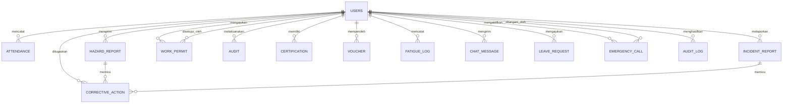

# DOKUMEN SPESIFIKASI KEBUTUHAN PERANGKAT LUNAK
## NURAGA — Integrated Safety Intelligence

**Versi:** 1.0  
**Tanggal:** 4 Juni 2026  
**Status:** Final
**Standar Acuan:** IEEE 830-1998

---

## 1. PENDAHULUAN

### 1.1 Tujuan Dokumen

Dokumen Spesifikasi Kebutuhan Perangkat Lunak (*Software Requirements Specification*/SRS) ini menetapkan kebutuhan fungsional dan non-fungsional secara menyeluruh untuk Sistem **Nuraga — Integrated Safety Intelligence**. Dokumen ini dirancang sebagai panduan bagi tim pengembang, pemangku kepentingan (*stakeholder*), serta tim penjaminan mutu (*Quality Assurance*) dalam memahami, mengimplementasikan, dan memvalidasi sistem secara terstruktur dan akuntabel.

### 1.2 Ruang Lingkup Aplikasi

**Nama Sistem:** Nuraga — Integrated Safety Intelligence  
**Kategori:** Sistem Informasi Keselamatan dan Kesehatan Kerja (K3/HSE) Terintegrasi  
**Platform Penyebaran:** Aplikasi Web Responsif  
**Klasifikasi Pengguna:** Multi-pengguna dengan Kontrol Akses Berbasis Peran (*Role-Based Access Control*/RBAC)

Nuraga merupakan solusi digital komprehensif yang dirancang untuk mendigitalisasi, mengotomatisasi, dan mengoptimalkan seluruh aspek manajemen Keselamatan dan Kesehatan Kerja di lingkungan industri dan proyek konstruksi. Sistem ini bertujuan untuk mencapai *zero accident* dan meningkatkan budaya keselamatan kerja melalui integrasi teknologi kecerdasan buatan (*AI*), analitik waktu-nyata (*real-time analytics*), serta alur kerja kolaboratif.

### 1.3 Konvensi Dokumen

- **[MUST]**: Kebutuhan yang wajib diimplementasikan.
- **[SHOULD]**: Kebutuhan yang sangat disarankan untuk diimplementasikan.
- **[MAY]**: Kebutuhan opsional untuk implementasi di masa mendatang.
- *Teks miring*: Istilah teknis asing yang tidak memiliki padanan kata baku dalam Bahasa Indonesia.
- **Teks tebal**: Istilah penting, judul, atau penekanan khusus.
- `Monospace`: Nama *field* basis data, variabel, atau nilai spesifik.

### 1.4 Audiens yang Dituju

1. **Pengembang *Backend* (Node.js/Express):** Untuk pemahaman *API*, logika bisnis, dan skema basis data.
2. **Pengembang *Frontend* (React.js/Vite):** Untuk spesifikasi desain antarmuka pengguna (*UI/UX*) dan alur kerja pengguna.
3. **Administrator Basis Data:** Untuk memahami struktur basis data dan relasinya.
4. **Manajer Proyek dan Pemangku Kepentingan:** Untuk memahami ruang lingkup, jadwal, dan *deliverables*.
5. **Insinyur Penjaminan Mutu (*QA*):** Untuk perancangan skenario pengujian dan kriteria penerimaan.
6. **Petugas K3/Manajer HSE:** Untuk verifikasi kepatuhan terhadap standar dan regulasi K3 yang berlaku.

### 1.5 Definisi, Akronim, dan Singkatan

| Singkatan | Definisi Lengkap |
|-----------|-----------------|
| **K3** | Keselamatan dan Kesehatan Kerja |
| **HSE** | *Health, Safety, and Environment* |
| **SRS** | *Software Requirements Specification* |
| **IEEE** | *Institute of Electrical and Electronics Engineers* |
| **RBAC** | *Role-Based Access Control* (Kontrol Akses Berbasis Peran) |
| **JWT** | *JSON Web Token* |
| **TRIR** | *Total Recordable Incident Rate* |
| **LTI** | *Lost Time Injury* (Cedera Hilang Waktu Kerja) |
| **APD** | Alat Pelindung Diri (*Personal Protective Equipment*/PPE) |
| **e-PTW** | *Electronic Permit to Work* (Izin Kerja Elektronik) |
| **QR** | *Quick Response* (kode matriks 2D) |
| **SOP** | *Standard Operating Procedure* (Prosedur Operasional Standar) |
| **API** | *Application Programming Interface* |
| **CRUD** | *Create, Read, Update, Delete* |
| **ORM** | *Object-Relational Mapping* |
| **CAPA** | *Corrective and Preventive Action* (Tindakan Perbaikan dan Pencegahan) |
| **XSS** | *Cross-Site Scripting* |
| **CORS** | *Cross-Origin Resource Sharing* |

---

## 2. DESKRIPSI KESELURUHAN SISTEM

### 2.1 Perspektif Produk

Nuraga merupakan aplikasi web berbasis *cloud* yang berfungsi sebagai pusat kendali terpadu untuk manajemen K3 di seluruh organisasi. Sistem ini mengintegrasikan berbagai modul yang saling terhubung guna memberikan visibilitas penuh terhadap:

- Status keselamatan kerja secara waktu-nyata (*real-time*).
- Riwayat insiden dan temuan bahaya (*hazard*).
- Kepatuhan terhadap regulasi K3 yang berlaku.
- Metrik kinerja keselamatan dan analisis tren.
- Kolaborasi antarperan dalam manajemen keselamatan.

**Arsitektur Sistem:**
```
┌─────────────────────────────────────────┐
│       Frontend (React.js + Vite)        │
│  ├─ Pemisahan Kode Dinamis             │
│  └─ Manajemen State & Routing          │
└──────────────────┬──────────────────────┘
                   │ (REST API melalui HttpOnly Cookies)
┌──────────────────▼──────────────────────┐
│   Backend (Node.js + Express.js)        │
│  ├─ cookie-parser & Middleware Keamanan │
│  ├─ Autentikasi (HttpOnly & Secure)    │
│  ├─ Integrasi AI & Ilmu Data           │
│  └─ Endpoint API & Pembatasan Laju     │
└──────────────────┬──────────────────────┘
                   │ (Kueri SQL)
┌──────────────────▼──────────────────────┐
│  Basis Data (PostgreSQL + Sequelize ORM)│
│  ├─ Konstrain Relasional (Cascade)     │
│  ├─ Data Historis & Log Audit          │
│  └─ Data Transaksional                 │
└─────────────────────────────────────────┘
```

### 2.2 Karakteristik Pengguna (Peran)

Berdasarkan struktur enumerasi pada skema basis data (`enum_Users_role`), sistem Nuraga mendukung enam peran dengan tingkatan hak akses sebagai berikut:

#### 2.2.1 Staff / Operator / Vendor (Tingkat Pekerja)
- **Tingkat Kemampuan:** Rendah hingga Menengah
- **Hak Akses:** Dasbor terbatas, pengiriman laporan bahaya dan insiden, pengajuan izin kerja (*e-PTW*).
- **Frekuensi Penggunaan:** Harian
- **Tugas Utama:** Presensi/absensi harian, pelaporan bahaya (*hazard*), penilaian mandiri tingkat kelelahan (*fatigue*).

#### 2.2.2 Supervisor (SPV)
- **Tingkat Kemampuan:** Menengah
- **Hak Akses:** Pemantauan tim, persetujuan tahap pertama untuk izin kerja.
- **Frekuensi Penggunaan:** Harian
- **Tugas Utama:** Pemantauan kehadiran bawahan, pengawasan laporan, evaluasi awal keselamatan kerja.

#### 2.2.3 HSE (*Health, Safety, and Environment Officer*)
- **Tingkat Kemampuan:** Tinggi
- **Hak Akses:** Akses analitik menyeluruh, verifikasi laporan insiden, pengelolaan gamifikasi.
- **Frekuensi Penggunaan:** Harian
- **Tugas Utama:** Pelaksanaan audit K3, persetujuan dokumen kritis, pengawasan metrik keselamatan.

#### 2.2.4 Manager
- **Tingkat Kemampuan:** Tinggi
- **Hak Akses:** Persetujuan akhir, dasbor strategis tingkat eksekutif.
- **Frekuensi Penggunaan:** Berkala (2—3 kali per minggu)
- **Tugas Utama:** Pengambilan keputusan strategis, peninjauan metrik keseluruhan.

#### 2.2.5 Admin
- **Tingkat Kemampuan:** Tinggi
- **Hak Akses:** Akses penuh ke seluruh konfigurasi sistem, manajemen pengguna, dan pengaturan keamanan.
- **Frekuensi Penggunaan:** Harian
- **Tugas Utama:** Manajemen data pengguna, kendali keamanan sistem, pemeliharaan konfigurasi.

### 2.3 Lingkungan Operasional

- **Platform:** Berbasis web, responsif untuk perangkat *desktop* dan *mobile*.
- **Dukungan Peramban:** Chrome v90+, Firefox v88+, Safari v14+, Edge v90+.
- **Jaringan:** Memerlukan konektivitas internet (minimal 1 Mbps).
- **Penyebaran:** Infrastruktur *cloud* AWS (EC2 t2.micro) dengan manajemen proses PM2. Dapat di-*host* secara *on-premise* bila diperlukan.
- **Jam Operasional:** Ketersediaan 24/7 dengan jendela pemeliharaan terjadwal.

### 2.4 Asumsi dan Dependensi

#### Asumsi Teknis
1. PostgreSQL versi 12 atau lebih baru tersedia dan dikonfigurasi dengan benar.
2. *Runtime* Node.js versi 18+ (direkomendasikan 20.x LTS) terpasang di peladen *backend*.
3. Peramban web modern tersedia bagi seluruh pengguna akhir.
4. Konektivitas jaringan stabil untuk semua lokasi operasional.
5. Kapasitas penyimpanan minimal 100 GB untuk data historis dan unggahan berkas.

#### Asumsi Organisasi
1. Setiap pengguna memiliki identifikasi unik dan alamat surel (*email*).
2. Struktur organisasi telah ditetapkan (Staff → Supervisor → HSE → Manager → Admin).
3. Kebijakan K3 telah terdokumentasi dan siap untuk didigitalisasi.
4. Anggaran untuk pemeliharaan dan peningkatan sistem telah dialokasikan.

#### Dependensi Eksternal
1. **Penyedia Layanan Surel:** Untuk notifikasi dan *One-Time Password* (OTP).
2. **WhatsApp Baileys (*WebSocket*):** Terhubung melalui protokol *WebSocket* untuk menyediakan *bot* notifikasi dan siaran darurat SOS secara waktu-nyata. Memerlukan manajemen sesi dan pemindaian Kode QR.
3. **Integrasi Kecerdasan Buatan (*AI*):** *API* internal (`nuraga-ai`) atau eksternal untuk prediksi data dan asisten cerdas.
4. **Layanan Penyimpanan Berkas:** Untuk penyimpanan dokumen dan unggahan bukti foto/lampiran.
5. **Infrastruktur Keamanan Pusat Data:** Keamanan fisik dan logis serta infrastruktur *backup*.

#### Dependensi Non-Fungsional
1. Sistem harus mendukung integrasi dengan sistem penggajian (*payroll*) yang sudah ada (melalui *API* di masa mendatang).
2. Sistem harus kompatibel dengan perangkat pemindai Kode QR.
3. Sistem dapat diintegrasikan dengan peralatan keselamatan berbasis IoT (sensor) di masa mendatang.

---

## 3. FITUR SISTEM & KEBUTUHAN FUNGSIONAL

### 3.1 MODUL 1: DASHBOARD & ANALYTICS

#### 3.1.1 Deskripsi

Dashboard adalah landing page utama setelah login yang menampilkan overview keselamatan kerja secara real-time. Dashboard harus dinamis berdasarkan role pengguna dan menyajikan key performance indicators (KPI) yang relevan dengan metrik K3 internasional.

#### 3.1.2 Kebutuhan Fungsional

**FR-1.1.1 [MUST]** Sistem harus menampilkan KPI utama pada dashboard:
- **TRIR (Total Recordable Incident Rate):** Dihitung sebagai (Jumlah insiden recordable × 200.000) / Total jam kerja
- **LTI Rate (Lost Time Injury Rate):** Dihitung sebagai (Jumlah LTI × 200.000) / Total jam kerja
- **Days Since Last Accident (DLSA):** Jumlah hari tanpa insiden recordable
- **Safety Compliance Score:** Persentase compliance dari checklist audit rutin

**FR-1.1.2 [MUST]** Sistem harus menyediakan visualisasi grafik dengan karakteristik:
- Trend line TRIR dan LTI dalam 12 bulan terakhir
- Distribution chart insiden berdasarkan kategori (Medical, Fire, Chemical, Evacuation)
- Pie chart hazard distribution berdasarkan risk level (Low/Medium/High)
- Bar chart top 5 hazard categories dan top 5 incident types
- Heatmap jam kerja dengan kejadian insiden (untuk pola analysis)

**FR-1.1.3 [MUST]** Dashboard harus menampilkan status real-time:
- Jumlah pekerja on-site hari ini
- Jumlah work permits aktif
- Open incidents/hazards yang require immediate action
- Alert notifikasi untuk events kritis (emergency, high-risk permits)

**FR-1.1.4 [SHOULD]** Sistem harus menyediakan predictive analytics:
- Prediksi TRIR untuk quarter berikutnya berdasarkan trend
- Identifikasi area/lokasi dengan risk level tertinggi
- Machine learning-based recommendation untuk preventive actions

**FR-1.1.5 [MUST]** Role-based dashboard customization:
- Staff: Hanya lihat KPI umum, status fatigue personal, scheduled permits
- SPV: Tambahan tim performance, pending approvals
- HSE: Access semua dashboard, deep analytics, trend forecasting
- Manager: Executive summary, high-level metrics, strategic trends

**FR-1.1.6 [MUST]** Sistem harus menyediakan export functionality:
- Export dashboard snapshot ke PDF format
- Export grafik ke image format (PNG, SVG)
- Export raw data ke CSV untuk further analysis

#### 3.1.3 Data yang Ditampilkan

```
Dashboard Data Model:
├─ KPI Metrics (calculated from Incident/Hazard records)
├─ Historical Time Series (12-month data)
├─ Real-time Status (today's attendance, active permits)
├─ Alert & Notification (pending approvals, critical events)
└─ User-specific Customization (widget preferences)
```

---

### 3.2 MODUL 2: ATTENDANCE & FATIGUE AI

#### 3.2.1 Deskripsi

Modul Absensi dan Monitoring Kelelahan mengintegrasikan sistem pencatatan kehadiran tradisional dengan AI-powered fatigue assessment. Sistem menganalisis pola tidur, jam kerja, dan stress level untuk memberikan rekomendasi fatigue status dan work capacity.

#### 3.2.2 Kebutuhan Fungsional

**FR-2.1.1 [MUST]** Sistem harus mencatat attendance dengan akurasi waktu:
- Fitur Check-In pada saat tiba di lokasi kerja
- Fitur Check-Out pada saat meninggalkan lokasi kerja
- Recording timestamp presisi ke second (00:00:00)
- Lokasi geografis capture (latitude/longitude) menggunakan geolocation browser
- Foto/selfie verification untuk mencegah proxy attendance [SHOULD]

**FR-2.1.2 [MUST]** Sistem harus mengumpulkan data fatigue personal:
- Daily input form untuk jam tidur malam sebelumnya (dalam format HH:MM)
- Stress level self-assessment (skala 1-10)
- Physical fatigue self-assessment (skala 1-10)
- Mental fatigue self-assessment (skala 1-10)
- Medical condition/complaints text field (opsional)

**FR-2.1.3 [MUST]** Sistem harus menghitung Fatigue Risk Index berdasarkan formula:
```
Fatigue Risk Index = (Sleep Quality Score × 0.35) + 
                     (Stress Level × 0.25) + 
                     (Physical Fatigue × 0.20) + 
                     (Mental Fatigue × 0.20)
```
- Kategori: GREEN (0-30, Safe to work), YELLOW (31-60, Monitor closely), RED (61-100, Not fit to work)

**FR-2.1.4 [MUST]** Sistem harus menyediakan Fatigue Status pada attendance record:
- **GREEN (Safe):** Rekomendasi normal duties
- **YELLOW (Caution):** Rekomendasi reduced workload, paired with buddy, frequent breaks
- **RED (Critical):** Rekomendasi tidak bekerja, mandatory rest, medical consultation

**FR-2.1.5 [MUST]** Sistem harus implement notifikasi otomatis:
- Alert ke Supervisor jika staff status RED
- Alert ke HSE Officer untuk tracking
- Recommendation message ke staff dengan saran istirahat dan recovery

**FR-2.1.6 [SHOULD]** Sistem harus tracking overtime dan shift pattern:
- Cumulative hours per week/month
- Shift rotation analysis (early/night shift impact)
- Recommendation untuk mandatory rest days berdasarkan hours worked

**FR-2.1.7 [MUST]** Attendance record harus mencakup:
- User ID dan Name
- Date (YYYY-MM-DD)
- Check-in time, Check-out time
- Duration worked (auto-calculated)
- Location (geolocation data)
- Fatigue assessment data
- Status (PRESENT/ABSENT/LEAVE/SICK)
- Approval status (PENDING/APPROVED/REJECTED)

**FR-2.1.8 [MUST]** Laporan Absensi Bulanan:
- Daftar lengkap kehadiran per employee per bulan
- Summary: present, absent, leave, sick days
- Cumulative fatigue trend
- Highlight pattern anomali (excessive overtime, chronic fatigue)

#### 3.2.3 Data Model

```
Attendance Record:
├─ attendance_id (PK)
├─ user_id (FK)
├─ date
├─ check_in_time, check_out_time
├─ duration_worked (calculated)
├─ location_latitude, location_longitude
├─ sleep_hours
├─ stress_level, physical_fatigue, mental_fatigue
├─ fatigue_risk_index (calculated)
├─ fatigue_status (ENUM: GREEN, YELLOW, RED)
├─ status (ENUM: PRESENT, ABSENT, LEAVE, SICK)
├─ approval_status
├─ created_at, updated_at
└─ notes (optional medical info)
```

---

### 3.3 MODUL 3: WORK PERMITS (e-PTW)

#### 3.3.1 Deskripsi

Work Permit to Work (e-PTW) adalah sistem elektronik untuk mengelola izin kerja khusus dan berbahaya. Sistem mengimplementasikan alur approval bertingkat dengan validasi hazard assessment dan APD yang komprehensif.

#### 3.3.2 Kebutuhan Fungsional

**FR-3.1.1 [MUST]** Work Permit harus memiliki struktur approval workflow:
```
DRAFT → SPV Approval → HSE Review → Manager Approval → ACTIVE → EXPIRED/CLOSED
```
- Setiap stage harus memiliki deadline dan notifikasi
- Ability untuk reject dengan mandatory reason/comment
- Rollback capability ke stage sebelumnya untuk revision

**FR-3.1.2 [MUST]** Setiap Work Permit harus mencakup informasi:
- **Basic Information:**
  - Permit ID (auto-generated format: PTW-YYYY-MM-DD-XXXX)
  - Permit Type (Confined Space, Hot Work, Electrical, Height Work, Excavation, Chemical Handling, dll)
  - Issue Date dan Valid Date (date range)
  - Location/Area
  - Work Description (detailed task description)
  - Start Time dan End Time (time range per hari)

- **Hazard Assessment:**
  - Identified hazards (multi-select dengan checkbox)
  - Risk level per hazard (Low/Medium/High)
  - Control measures (mitigation strategies)
  - Additional safety requirements
  - Pre-work safety briefing checklist (MUST be signed by all workers)

- **Manpower & APD:**
  - List of authorized workers (dengan name, ID, signature field)
  - Job role per worker (Foreman, Operator, Spotter, etc)
  - Required APD (multi-select dari APD master list)
  - APD inspection log (condition status: OK/DAMAGED/EXPIRED)
  - Safety equipment required (harness, ladder, extinguisher, etc)

- **Gas Test & Environmental:**
  - Gas detection result (O2, LEL, H2S levels dengan normal range)
  - Test timestamp dan tester name
  - Environmental condition (temperature, weather, humidity)
  - Permit validity condition (gas test valid untuk 8 jam atau sampai work selesai)

- **Approval Signatures:**
  - SPV approval dengan signature (digital/electronic)
  - HSE Officer approval dengan signature
  - Manager final approval dengan signature
  - Revoke capability dengan reason

**FR-3.1.3 [MUST]** Sistem harus menyediakan permit search dan filtering:
- Filter by Status (Draft, Pending Approval, Active, Expired, Closed)
- Filter by Permit Type
- Filter by Location/Area
- Filter by Date Range
- Search by Permit ID, Worker Name
- Sort by Issue Date, Expiry Date, Risk Level

**FR-3.1.4 [MUST]** Sistem harus track permit history:
- Audit trail untuk setiap perubahan status
- Version control untuk setiap revision
- Log approval timestamps dan approver identities
- Change log untuk field-field penting (hazard, APD, workers)

**FR-3.1.5 [SHOULD]** Sistem harus menyediakan smart recommendations:
- Suggestion of typical hazards berdasarkan Permit Type
- Suggestion APD berdasarkan identified hazards
- Suggestion control measures dari historical permits

**FR-3.1.6 [MUST]** Sistem harus implement permit lifecycle management:
- Auto-expiration pada validity end date
- Reminder notifikasi 1 hari sebelum expiry
- Permit closure dengan completion report
- Extension capability dengan re-validation (max 2x extension per permit)

**FR-3.1.7 [MUST]** Work Permit Status Dashboard:
- Display all active permits untuk HSE Officer
- Pending approval permits dengan responsible approver
- Expired permits dengan list of workers yang perlu briefing
- Historical closed permits dengan completion statistics

**FR-3.1.8 [MUST]** Reporting & Analytics:
- Permit issuance rate dan trend
- Hazard frequency distribution dari permits
- Average approval time per stage
- APD usage statistics
- Compliance rate dengan permit requirements

#### 3.3.3 Data Model

```
WorkPermit:
├─ permit_id (PK)
├─ permit_type (ENUM)
├─ location, work_description
├─ issue_date, valid_from, valid_to
├─ status (ENUM: DRAFT, PENDING, ACTIVE, EXPIRED, CLOSED)
├─ created_by_user_id (FK)
├─ created_at, updated_at

PermitHazard (junction table):
├─ permit_id (FK)
├─ hazard_id (FK)
├─ risk_level (ENUM)
└─ control_measures (text)

PermitWorker (junction table):
├─ permit_id (FK)
├─ user_id (FK)
├─ job_role
└─ signed_at (timestamp)

PermitAPD (junction table):
├─ permit_id (FK)
├─ apd_id (FK)
└─ condition_status (ENUM)

PermitGasTest:
├─ test_id (PK)
├─ permit_id (FK)
├─ oxygen_level, lel_level, h2s_level
├─ tested_by_user_id (FK)
├─ tested_at
└─ valid_until

PermitApproval (audit trail):
├─ approval_id (PK)
├─ permit_id (FK)
├─ approver_user_id (FK)
├─ approval_stage (ENUM)
├─ status (ENUM: APPROVED, REJECTED)
├─ reason_if_rejected
└─ approved_at
```

---

### 3.4 MODUL 4: HAZARD REPORTS

#### 3.4.1 Deskripsi

Modul Pelaporan Hazard memungkinkan setiap pekerja melaporkan potensi bahaya di lapangan secara cepat dan mudah. Sistem akan track status penyelesaian dan provide analytics untuk preventive action planning.

#### 3.4.2 Kebutuhan Fungsional

**FR-4.1.1 [MUST]** Sistem harus menyediakan hazard report form dengan fields:
- **Report Identification:**
  - Report ID (auto-generated: HZD-YYYY-MM-DD-XXXX)
  - Report Date & Time (auto-captured dari system)
  - Reporter (auto-filled dari logged-in user)
  - Location/Area (dengan geographic markers jika possible)

- **Hazard Description:**
  - Category (multi-select: Electrical Hazard, Chemical Spill, Unsafe Act, Unsafe Condition, Ergonomic Hazard, Fire Risk, dll)
  - Description (detailed text, min 20 characters)
  - Photos/Attachments (up to 5 images, max 5MB per image)
  - Video evidence [SHOULD]

- **Risk Assessment:**
  - Risk Level self-assessment (Low/Medium/High)
  - Potential Consequence (injury type, severity)
  - Number of people affected
  - Estimated frequency jika tidak ditangani

- **Immediate Action:**
  - Corrective action taken oleh reporter
  - Temporary measure status
  - Escalation to Supervisor [SHOULD] (immediate notification)

**FR-4.1.2 [MUST]** Sistem harus implement hazard status lifecycle:
```
OPEN → ASSIGNED → IN PROGRESS → RESOLVED → CLOSED
```
- Initial status: OPEN (after report submission)
- Supervisor dapat ASSIGN ke specific person/team
- Assigned person update status ke IN PROGRESS dengan action plan
- Reporter atau HSE verify RESOLVED status
- Final CLOSED dengan verification completion
- Ability untuk RE-OPEN jika issue resurface

**FR-4.1.3 [MUST]** Sistem harus menyediakan hazard assignment:
- Assign hazard ke specific person/team dengan deadline
- Add corrective action checklist
- Timeline tracking dan progress monitoring
- Attachment upload untuk solution proof (photos, documents)
- Digital signature dari person-in-charge setelah completion

**FR-4.1.4 [MUST]** Hazard tracking dashboard:
- List of all open hazards dengan age (days open)
- Hazards by risk level (HIGH hazards priority)
- Hazard by category dengan distribution chart
- HIGH risk hazards harus have visible escalation status
- Hazards overdue (deadline passed) harus highlighted

**FR-4.1.5 [MUST]** Sistem harus mengimplementasikan alert & notification:
- Real-time notification ke Supervisor saat HIGH risk report
- Daily summary ke HSE Officer untuk pending hazards
- Reminder sebelum deadline untuk assigned hazards
- Notification ke reporter tentang status updates

**FR-4.1.6 [SHOULD]** Analytics & Reporting:
- Hazard trend analysis (daily/weekly/monthly open hazards)
- Most common hazard categories dengan historical data
- Average resolution time per category
- Correlation antara hazards dan incidents (hazard yang tidak ditangani → incident)
- Hotspot mapping (lokasi/area dengan hazard tertinggi)

**FR-4.1.7 [MUST]** Hazard Details View:
- Full hazard report display dengan history
- Audit trail dari semua status changes dan comments
- Timeline view dari open → closed
- All assigned corrective actions dengan deadlines
- Resolution details dan validation proof

**FR-4.1.8 [MUST]** Bulk operations:
- Bulk reassign hazards ke person/team lain
- Bulk update status (in progress, resolved)
- Bulk export hazard reports ke PDF/Excel

#### 3.4.3 Data Model

```
HazardReport:
├─ hazard_id (PK)
├─ report_id (unique)
├─ reporter_user_id (FK)
├─ location
├─ category (ENUM)
├─ description, risk_level
├─ status (ENUM)
├─ created_at, updated_at
└─ resolved_at (nullable)

HazardCategory (master data):
├─ category_id (PK)
├─ category_name
└─ severity_baseline

HazardAttachment:
├─ attachment_id (PK)
├─ hazard_id (FK)
├─ file_path, file_size
└─ uploaded_at

HazardAssignment:
├─ assignment_id (PK)
├─ hazard_id (FK)
├─ assigned_to_user_id (FK)
├─ assigned_by_user_id (FK)
├─ assigned_date, deadline
└─ status (ENUM)

HazardHistory (audit trail):
├─ history_id (PK)
├─ hazard_id (FK)
├─ action (ENUM: CREATED, STATUS_CHANGED, ASSIGNED, etc)
├─ old_value, new_value
├─ changed_by_user_id (FK)
└─ changed_at
```

---

### 3.5 MODUL 5: INCIDENT REPORTS

#### 3.5.1 Deskripsi

Modul Incident Report mengelola pelaporan kecelakaan kerja dengan akurasi tinggi, including root cause analysis otomatis menggunakan metode 5-Whys, estimasi loss cost, dan follow-up corrective action tracking.

#### 3.5.2 Kebutuhan Fungsional

**FR-5.1.1 [MUST]** Incident Report Form mencakup:
- **Incident Details:**
  - Incident ID (auto-generated: INC-YYYY-MM-DD-XXXX)
  - Date & Time of Incident (precise timestamp)
  - Location/Area
  - Incident Category (Medical Injury, Fire, Chemical Exposure, Equipment Failure, Environmental, dll)
  - Incident Type (Minor, Major, Serious, Fatal) - auto-assess based on consequences

- **Involved Personnel:**
  - Affected employee(s) name, ID, job role
  - Injured body part/organ (jika applicable)
  - Injury type (cut, fracture, burn, poisoning, etc)
  - Injury severity (First Aid, Medical Treatment, Hospitalization, Permanent Disability, Fatality)

- **Incident Narrative:**
  - What happened (detailed description)
  - How it happened (sequence of events)
  - Why it happened (preliminary causes)
  - Witnesses (names & contact, dapat assign untuk witness statement)
  - Photos/Videos (up to 10 items)
  - Preliminary immediate action taken

- **Financial Impact Assessment:**
  - Medical cost (treatment, hospitalization)
  - Equipment damage cost
  - Production loss cost
  - Worker compensation cost
  - Total Loss Cost (auto-sum) dengan business impact rating

**FR-5.1.2 [MUST]** Sistem harus implement 5-Whys Root Cause Analysis:
```
Incident → Why 1? → Why 2? → Why 3? → Why 4? → Why 5? → Root Cause
```
- Interactive wizard untuk guiding 5-Whys process
- System suggest Why level recommendations berdasarkan incident type
- Dokumentasi setiap why level dengan supporting evidence
- Final root cause statement generation
- Auto-flag untuk systemic/process root causes (bukan hanya individual)

**FR-5.1.3 [MUST]** Incident Severity & Classification:
- **Minor:** First aid, no lost time (Minor Injury)
- **Major:** Medical treatment, some lost time (Reportable Injury)
- **Serious:** Hospitalization, extended lost time (Lost Time Injury/LTI)
- **Fatal:** Fatality (MUST immediate escalation)

System auto-classifies berdasarkan injury type dan treatment level.

**FR-5.1.4 [MUST]** Incident Approval Workflow:
```
REPORTED → Department SPV Approval → HSE Investigation → Manager Review → CLOSED
```
- Initial report oleh witness/affected person
- SPV acknowledge dan provide initial investigation
- HSE conduct formal investigation dengan evidence collection
- Manager review root cause analysis dan corrective action plan
- Final closure dengan lessons learned documentation

**FR-5.1.5 [MUST]** Corrective Actions Linked to Incidents:
- Auto-generate corrective action items dari identified root causes
- Define responsible person, deadline, dan success criteria
- Progress tracking integrated dengan Corrective Action modul
- Closure verification sebelum incident dapat di-close

**FR-5.1.6 [MUST]** Incident Investigation Report:
- Structured template untuk formal investigation
- Evidence collection documentation (witness statements, photos, equipment inspection)
- Timeline reconstruction
- System failure analysis (jika applicable)
- HSE Officer digital signature pada investigation completion

**FR-5.1.7 [MUST]** Notifications & Escalation:
- IMMEDIATE notification ke HSE Officer & Manager untuk SERIOUS/FATAL incidents
- SMS/WhatsApp alert untuk emergency incidents
- Daily summary untuk pending investigations
- Reminder sebelum deadline untuk investigation completion

**FR-5.1.8 [MUST]** Analytics & Trend:
- Incident rate trending (monthly, quarterly, annual)
- Incident distribution by type, location, shift
- LTI tracking dan TRIR calculation contribution
- Root cause frequency analysis (top causes)
- Corrective action effectiveness tracking (incident resurface rate)
- Correlation analysis: hazard reports → incidents (conversion rate)

**FR-5.1.9 [MUST]** Confidentiality & Access Control:
- Sensitive data (affected employee details) protected dengan restricted access
- Only authorized roles dapat view full incident details
- Investigation report hanya accessible ke HSE + Manager
- Worker dapat view own incident report dan corrective actions

**FR-5.1.10 [SHOULD]** Incident Prevention:
- AI-based recommendation untuk similar hazards prevention
- Lessons learned documentation
- Automatic incident alert jika pattern detected (e.g., 2nd incident same type in 30 days)
- Near-miss tracking (dangerous situations yang avoided)

#### 3.5.3 Data Model

```
IncidentReport:
├─ incident_id (PK)
├─ report_id (unique)
├─ date_time
├─ location, category, type
├─ description, narrative
├─ severity (ENUM)
├─ status (ENUM)
├─ total_loss_cost
├─ reported_by_user_id (FK)
├─ investigating_officer_id (FK)
├─ created_at, updated_at
└─ closed_at (nullable)

IncidentAffected (affected personnel):
├─ affected_id (PK)
├─ incident_id (FK)
├─ user_id (FK)
├─ injury_type, injured_part
├─ injury_severity
└─ treatment_required

RootCauseAnalysis:
├─ analysis_id (PK)
├─ incident_id (FK)
├─ why_1, why_2, why_3, why_4, why_5
├─ root_cause_statement
├─ analysis_by_user_id (FK)
└─ analyzed_at

IncidentCorrective (junction to Corrective Action):
├─ incident_id (FK)
├─ corrective_action_id (FK)
└─ created_at

IncidentAttachment:
├─ attachment_id (PK)
├─ incident_id (FK)
├─ file_path, file_type
└─ uploaded_at

IncidentHistory (audit trail):
├─ history_id (PK)
├─ incident_id (FK)
├─ action (ENUM)
├─ details (JSON)
├─ changed_by_user_id (FK)
└─ changed_at
```

---

### 3.6 MODUL 6: EMERGENCY RESPONSE (SOS)

#### 3.6.1 Deskripsi

Modul Emergency Response menyediakan sistem SOS (emergency button) yang memungkinkan pekerja melaporkan keadaan darurat dengan cepat. Sistem harus memfasilitasi koordinasi response team dan track emergency resolution time.

#### 3.6.2 Kebutuhan Fungsional

**FR-6.1.1 [MUST]** Emergency Button UI/UX:
- Large, easily accessible SOS button di mobile app dan web dashboard
- Single tap/click untuk activate emergency
- Clear visual and audio feedback (vibration, sound alert)
- No additional confirmation prompt (immediate action)
- Prominent display dengan red color (#DC2626)

**FR-6.1.2 [MUST]** Emergency Type Selection:
```
Medical → First Aid, Injury, Health Crisis, Mental Health
Fire → Fire in Building, Equipment Fire, Chemical Fire
Chemical → Gas Leak, Chemical Spill, Toxic Exposure
Evacuation → Earthquake, Security Threat, Structural Hazard, Other
```
- Quick selection interface after SOS button pressed
- Predefined templates untuk each emergency type

**FR-6.1.3 [MUST]** Emergency Activation Workflow:
1. User press SOS button → Auto-capture location (geolocation)
2. System select emergency type (Medical/Fire/Chemical/Evacuation)
3. Optional: Add voice message atau text description
4. System immediately notify Emergency Response Team:
   - HSE Officer (highest priority)
   - Manager
   - Selected emergency responders
5. System track response time (time dari activation hingga first responder arrival)

**FR-6.1.4 [MUST]** Automatic System Actions upon Emergency:
- Lock down nearby work areas (visual notification ke semua workers)
- Activate automated alert system (alarm, siren, flashing lights jika terintegrasi)
- Send SMS/WhatsApp push notification ke responders dengan:
  - Emergency type
  - Location (map link)
  - Affected personnel info (jika known)
  - Quick action buttons (Acknowledge, Responding, Resolved)
- Activate incident tracking (auto-create incident record)

**FR-6.1.5 [MUST]** Emergency Response Coordination:
- Real-time status update untuk responding team
- Live location tracking dari emergency location di map
- Estimated arrival time untuk nearest responders
- Emergency hotline connection (click-to-call feature)
- Virtual communication channel (group chat untuk responders)

**FR-6.1.6 [MUST]** Emergency Resolution:
- First responder update status → Responding, On-Site, Under-Control, Resolved
- Responder dapat add photos/notes dari emergency scene
- Final closure dengan damage assessment dan corrective measures initiated
- Timeline capture: activation time → first response → resolution time

**FR-6.1.7 [MUST]** Emergency Dashboard:
- Active emergencies list dengan real-time status
- Emergency history dengan response metrics
- Response time analytics (average time for each type)
- Map view showing emergency locations
- Responder availability tracking

**FR-6.1.8 [MUST]** Post-Emergency Actions:
- Auto-link ke Incident Report modul (detailed investigation)
- Auto-generate Hazard Report jika applicable
- Post-incident review dengan response team
- Corrective action generation based on incident root cause

**FR-6.1.9 [SHOULD]** Integration dengan Emergency Services:
- Auto-dial emergency hotline (911, 112, local equivalent)
- Auto-send location coordinates untuk GPS tracking oleh authorities
- Integration dengan local emergency response team (jika API available)

**FR-6.1.10 [MUST]** Emergency Drill Capability:
- Mock emergency activation untuk training purposes
- System harus track drill activations separately dari real emergencies
- Drill mode clear indication (e.g., "DRILL MODE" label)
- Response time measurement untuk drill effectiveness

#### 3.6.3 Data Model

```
EmergencyAlert:
├─ alert_id (PK)
├─ activation_time (timestamp)
├─ emergency_type (ENUM)
├─ location_latitude, location_longitude
├─ is_drill (boolean)
├─ activated_by_user_id (FK)
├─ description (optional)
├─ status (ENUM: ACTIVE, RESPONDING, RESOLVED, CLOSED)
└─ closed_at (nullable)

EmergencyResponder (assigned responders):
├─ responder_id (PK)
├─ alert_id (FK)
├─ user_id (FK)
├─ notification_time
├─ acknowledgement_time (nullable)
├─ arrival_time (nullable)
└─ status (ENUM)

EmergencyAttachment:
├─ attachment_id (PK)
├─ alert_id (FK)
├─ file_path (photo/voice)
└─ uploaded_at

EmergencyTimeline (audit trail):
├─ timeline_id (PK)
├─ alert_id (FK)
├─ event (ENUM: ACTIVATED, RESPONDING, ARRIVED, RESOLVED)
├─ timestamp
├─ notes (optional)
└─ updated_by_user_id (FK)
```

---

### 3.7 MODUL 7: SAFETY AUDITS

#### 3.7.1 Deskripsi

Modul Safety Audits memfasilitasi inspeksi K3 rutin menggunakan checklist structured dan QR code scanning untuk aset management. Sistem track audit history dan generate compliance reports.

#### 3.7.2 Kebutuhan Fungsional

**FR-7.1.1 [MUST]** Audit Scheduling & Setup:
- Create audit plan dengan frequency (daily, weekly, monthly, quarterly, annual)
- Assign audit checklist template ke specific area/location
- Schedule audit date & time dengan responsible auditor
- Allow flexible scheduling dengan rescheduling capability
- Reminder notification kepada assigned auditor sebelum audit date

**FR-7.1.2 [MUST]** Audit Checklist Structure:
- Master checklist templates per audit type (e.g., General K3, Confined Space, Hot Work, etc)
- Checklist items dengan:
  - Item number dan description
  - Category (Facility, Equipment, Personnel, Process, Documentation, etc)
  - Compliance standard reference (e.g., SNI, OSHA, ISO standards)
  - Priority level (Critical, High, Medium, Low)
  - Expected evidence type (photo, document, verbal verification)
  - Yes/No question atau rating scale (1-5)

**FR-7.1.3 [MUST]** Audit Execution dengan QR Code:
- Mobile-optimized audit form dengan real-time progress
- QR code scanning untuk asset identification:
  - Scan aset QR code → Auto-populate asset info (serial number, location, last maintenance date)
  - Verify item condition berdasarkan physical inspection
  - Capture photos sebagai evidence
  - Record condition status (OK, DAMAGED, EXPIRED, MAINTENANCE REQUIRED)
- Manual input option jika QR code unavailable

**FR-7.1.4 [MUST]** Audit Form Features:
- Progress indicator (X of Y items completed)
- Comment field untuk non-compliance findings
- Photo attachment untuk evidence (up to 5 per item)
- Signature field dari auditor pada completion
- Timestamp auto-capture

**FR-7.1.5 [MUST]** Audit Findings & Non-Compliance:
- System auto-identify non-compliant items (answered "No" atau rated < 3)
- Generate findings list dengan:
  - Finding ID
  - Item tidak sesuai
  - Category problem (safety risk, maintenance issue, documentation gap)
  - Risk level (Low/Medium/High)
  - Recommended corrective action
  - Deadline untuk action
- Auto-link ke Corrective Action modul untuk tracking

**FR-7.1.6 [MUST]** Audit Report Generation:
- Comprehensive audit report dengan:
  - Audit date, location, auditor name
  - Overall compliance score (percentage)
  - Summary findings (total findings by risk level)
  - Detailed findings dengan photos dan recommendations
  - Corrective action items dengan timeline
  - Digital signature dari auditor dan HSE Officer
- Export to PDF format
- Sign-off capability dari area manager

**FR-7.1.7 [MUST]** Audit Tracking Dashboard:
- Schedule view (upcoming audits, overdue audits)
- Completed audits dengan results
- Open findings dari audits (by risk level)
- Corrective action status dari audit findings
- Trend analysis (compliance score over time per location)

**FR-7.1.8 [SHOULD]** Asset Management Integration:
- Master asset database (equipment, machinery, facilities)
- Asset maintenance history linked to audit findings
- Preventive maintenance scheduling based on audit results
- Asset decommissioning tracking

**FR-7.1.9 [MUST]** Compliance Reporting:
- Monthly audit summary per location
- Quarterly compliance trend analysis
- Year-to-date compliance scorecard
- Non-compliance trending (repeated findings per item)
- Auditor performance metrics (finding frequency)

**FR-7.1.10 [SHOULD]** Mobile Audit Offline Mode:
- Download checklist untuk offline completion
- Offline photo capture dan form filling
- Auto-sync saat internet connection restored
- Conflict resolution jika duplicate audit submission

#### 3.7.3 Data Model

```
AuditPlan:
├─ plan_id (PK)
├─ location
├─ checklist_template_id (FK)
├─ scheduled_date, scheduled_time
├─ assigned_auditor_user_id (FK)
├─ frequency (ENUM)
├─ status (ENUM: SCHEDULED, IN_PROGRESS, COMPLETED, OVERDUE)
└─ created_at

ChecklistTemplate (master data):
├─ template_id (PK)
├─ template_name, audit_type
└─ created_at

ChecklistItem (master data):
├─ item_id (PK)
├─ template_id (FK)
├─ item_number, description
├─ category, priority
├─ standard_reference
└─ item_type (YES_NO, RATING, SCALE)

AuditExecution:
├─ execution_id (PK)
├─ plan_id (FK)
├─ start_time, end_time
├─ executed_by_user_id (FK)
├─ status (ENUM)
└─ overall_compliance_score

AuditItemResponse:
├─ response_id (PK)
├─ execution_id (FK)
├─ item_id (FK)
├─ response (ENUM: YES, NO, PARTIAL, or NUMERIC)
├─ comment
└─ photo_path

AuditFinding:
├─ finding_id (PK)
├─ execution_id (FK)
├─ item_id (FK)
├─ risk_level (ENUM)
├─ recommended_action
├─ deadline
├─ corrective_action_id (FK, nullable)
└─ created_at

AssetMaster:
├─ asset_id (PK)
├─ asset_code, asset_name
├─ qr_code_id (unique)
├─ location, category
├─ last_maintenance_date
├─ status (ENUM)
└─ created_at
```

---

### 3.8 MODUL 8: CORRECTIVE ACTIONS

#### 3.8.1 Deskripsi

Modul Corrective Actions mengelola semua tindakan perbaikan yang dihasilkan dari audit findings, incident investigations, atau hazard reports. Sistem track progress, deadline, dan responsibility dengan accountability penuh.

#### 3.8.2 Kebutuhan Fungsional

**FR-8.1.1 [MUST]** Corrective Action Creation:
- Auto-creation dari audit findings, incidents, hazards
- Manual creation option untuk proactive improvements
- Corrective Action ID: CA-YYYY-MM-DD-XXXX (auto-generated)
- Link ke originating record (audit/incident/hazard)
- Priority level: Critical, High, Medium, Low

**FR-8.1.2 [MUST]** Corrective Action Structure:
- **Problem Statement:**
  - Issue description (what needs to be fixed)
  - Root cause (linked dari incident 5-Whys atau audit finding)
  - Risk if not addressed

- **Corrective Action Plan:**
  - Action description (detailed steps)
  - Responsible person (assign ke specific individual)
  - Required resources (budget, materials, training)
  - Timeline: Start date, Target completion date
  - Success criteria (how to verify completion)

- **Implementation:**
  - Progress tracking (% complete)
  - Status: Open → In Progress → Completed → Verified → Closed
  - Action updates (comments, photo evidence)
  - Resource utilization tracking
  - Risk: Can mark "At Risk" jika deadline threatened

- **Verification:**
  - Completion verification oleh responsible person
  - Independent verification oleh HSE/Manager
  - Evidence documentation (photos, test results, certificates)
  - Follow-up inspection jika required

**FR-8.1.3 [MUST]** Corrective Action Workflow:
```
OPEN → ASSIGNED → IN_PROGRESS → COMPLETED → VERIFIED → CLOSED
```
- Status change notifications ke responsible person
- Escalation alerts jika approaching deadline
- Re-open capability jika verification failed (return ke IN_PROGRESS)

**FR-8.1.4 [MUST]** Tracking & Accountability:
- Dashboard showing all open corrective actions
- Filter by: Status, Priority, Responsible Person, Due Date, Origin (Audit/Incident/Hazard)
- Overdue corrective actions highlighted dengan red flag
- Responsible person notification untuk pending actions
- Audit trail untuk all status changes

**FR-8.1.5 [MUST]** Deadline Management:
- Set deadline dengan business days consideration
- Automatic reminder 3 days, 1 day before deadline
- Allow deadline extension dengan justification
- Track extension history (original vs extended deadline)
- Escalation to Manager jika extension requested

**FR-8.1.6 [MUST]** Effectiveness Tracking:
- Flag "Preventive" corrective action yang mengcegah future occurrence
- Track if origin incident/hazard resurface → indicates ineffective action
- Analytics: Corrective action completion rate
- Correlation: Completed CA vs incident/hazard reduction

**FR-8.1.7 [SHOULD]** Smart Assignment:
- Recommend responsible person berdasarkan expertise/role
- Suggest similar completed actions untuk reference
- Auto-notify related parties (e.g., supervisor dari responsible person)

**FR-8.1.8 [MUST]** Bulk Operations:
- Bulk status update (multiple CA at once)
- Bulk reassign actions
- Bulk extend deadlines dengan reason

**FR-8.1.9 [MUST]** Reporting:
- Corrective action completion statistics (by month, origin, category)
- Average completion time per category
- Responsible person performance (completion rate, timeliness)
- Cost tracking dari implemented actions (budget vs actual)

#### 3.8.3 Data Model

```
CorrectiveAction:
├─ action_id (PK)
├─ action_id_display (CA-YYYY-MM-DD-XXXX)
├─ origin_type (ENUM: AUDIT, INCIDENT, HAZARD)
├─ origin_id (references audit/incident/hazard)
├─ problem_statement
├─ root_cause
├─ action_description
├─ responsible_user_id (FK)
├─ priority (ENUM)
├─ start_date, target_completion_date
├─ actual_completion_date (nullable)
├─ status (ENUM)
├─ success_criteria
├─ is_preventive (boolean)
├─ created_by_user_id (FK)
├─ created_at, updated_at
└─ closed_at (nullable)

CAProgressUpdate:
├─ update_id (PK)
├─ action_id (FK)
├─ progress_percent
├─ status_update (text)
├─ photo_attachment (nullable)
├─ updated_by_user_id (FK)
└─ updated_at

CAVerification:
├─ verification_id (PK)
├─ action_id (FK)
├─ verified_by_user_id (FK)
├─ verification_date
├─ is_effective (boolean)
├─ evidence (text/attachment)
└─ notes

CADeadlineExtension:
├─ extension_id (PK)
├─ action_id (FK)
├─ original_deadline
├─ new_deadline
├─ extension_reason
├─ approved_by_user_id (FK)
└─ extended_at
```

---

### 3.9 MODUL 9: CERTIFICATIONS

#### 3.9.1 Deskripsi

Modul Certifications memantau dan manage sertifikasi/lisensi K3 dari pekerja. Sistem track tanggal expiry dan provide reminders untuk renewal planning.

#### 3.9.2 Kebutuhan Fungsional

**FR-9.1.1 [MUST]** Certification Master Data:
- Master list of certification types:
  - Ahli K3 Umum (3-year validity)
  - Ahli K3 Konstruksi (3-year validity)
  - Ahli K3 Pertambangan (3-year validity)
  - SIO (Safety Induction Officer) - Forklift (1-year validity)
  - SIO - Scaffolding (1-year validity)
  - First Aid Certificate (2-year validity)
  - Fire Safety (1-2 year validity)
  - Custom certifications per company requirement

**FR-9.1.2 [MUST]** Employee Certification Record:
- Certificate ID (auto-generated: CERT-XXXX-YYYY)
- Employee linked
- Certification type
- Issue date
- Expiry date
- Issuing authority
- Certificate document (PDF upload)
- Renewal history tracking

**FR-9.1.3 [MUST]** Expiry Monitoring:
- Dashboard showing certification status:
  - **ACTIVE:** Valid (green indicator)
  - **EXPIRING SOON:** 30 days before expiry (yellow indicator, alert)
  - **EXPIRED:** Past expiry date (red indicator, high alert)
  - **RENEWAL PENDING:** Submitted renewal, awaiting validation
- Filters: By employee, by cert type, by status
- Bulk view untuk entire organization certification status

**FR-9.1.4 [MUST]** Notification & Reminder:
- Auto-reminder kepada employee 60 days before expiry
- Reminder kepada HR/Manager 30 days before
- Notification kepada HSE Officer saat certification expired
- Email dengan renewal procedure instructions

**FR-9.1.5 [MUST]** Renewal Process:
- Employee request renewal dengan old certificate photo
- System validate against master database (check against Ministry records jika API available)
- Store renewal records dan track pending renewals
- Ability to upload new certificate upon completion
- Mark certificate as RENEWED dengan new expiry date

**FR-9.1.6 [MUST]** Certification Report:
- Export employee certifications status (per employee, per team, per department)
- Certification expiry calendar (visual timeline)
- Renewal pipeline (pending renewals, expected completion)
- Compliance status (% of employees dengan valid certs per role)
- Cost tracking untuk renewal programs

**FR-9.1.7 [SHOULD]** Training Recommendation:
- Auto-trigger training recommendation 6 months before expiry
- Link to training provider atau internal training schedule
- Track training completion linked to certification renewal

**FR-9.1.8 [MUST]** Access Control Integration:
- System dapat restrict system access untuk users dengan expired certifications [SHOULD]
- Alert manager jika critical role person has expired cert
- Restrict assignment untuk task requiring specific cert jika cert expired

#### 3.9.3 Data Model

```
CertificationType (master data):
├─ cert_type_id (PK)
├─ cert_name
├─ validity_years
├─ issuing_authority
└─ created_at

EmployeeCertification:
├─ cert_record_id (PK)
├─ cert_id_display (CERT-XXXX-YYYY)
├─ user_id (FK)
├─ cert_type_id (FK)
├─ issue_date, expiry_date
├─ certificate_document_path
├─ issuing_authority
├─ status (ENUM: ACTIVE, EXPIRING_SOON, EXPIRED, RENEWAL_PENDING)
├─ created_at
└─ updated_at

CertificationRenewal:
├─ renewal_id (PK)
├─ cert_record_id (FK)
├─ renewal_date
├─ new_certificate_path
├─ renewed_by_user_id (FK)
├─ old_expiry_date
├─ new_expiry_date
└─ created_at

CertificationAlert:
├─ alert_id (PK)
├─ cert_record_id (FK)
├─ alert_type (ENUM: 60_DAY, 30_DAY, EXPIRED)
├─ user_id (FK) [who should be alerted]
├─ sent_at
└─ acknowledged_at (nullable)
```

---

### 3.10 MODUL 10: GAMIFICATION & REWARDS

#### 3.10.1 Deskripsi

Modul Gamification memotivasi pekerja untuk aktif berkontribusi pada keselamatan kerja melalui sistem poin dan reward. Sistem mendorong pelaporan hazard, incident reporting, dan participation dalam safety program.

#### 3.10.2 Kebutuhan Fungsional

**FR-10.1.1 [MUST]** Points System:
- Point allocation untuk berbagai safety-related activities:
  - Report hazard: 5 points
  - Report incident: 3 points (less incentivized, incident adalah negative event)
  - Attend safety training: 10 points
  - Complete audit: 15 points (for auditors)
  - Certify/renew certification: 20 points
  - Perfect attendance (bulan full): 5 points
  - Zero fatigue status (3 hari GREEN): 3 points
  - Daily login ke system: 1 point

**FR-10.1.2 [MUST]** Leaderboard:
- Individual leaderboard dibatasi hanya untuk menampilkan **Top 20** karyawan secara default pada UI untuk optimasi *rendering* memori peramban (*browser memory management*).
- Team leaderboard (aggregated points dari team members)
- Department leaderboard
- Show ranking dengan points total, activities count, achievements
- Display top performers dengan badges

**FR-10.1.3 [MUST]** Achievements & Badges:
- Badge system untuk milestone achievement:
  - "Safety Champion": 500+ points/month
  - "Hazard Hunter": 10+ hazard reports/month
  - "Perfect Attendance": Zero absences/month
  - "Guardian Angel": First to respond 3x emergency alerts
  - "Certified Expert": Multiple valid K3 certifications
  - "Clean Month": Zero incidents dalam bulan
  - Unlock custom achievements per organization

**FR-10.1.4 [MUST]** Rewards & Vouchers:
- Point redemption untuk merchandise/vouchers:
  - 50 points: Rp 50.000 voucher (mini-market, cafe, etc)
  - 100 points: Rp 100.000 voucher
  - 200 points: Rp 250.000 voucher
  - 500 points: Special merchandise (branded shirt, cap, water bottle, safety equipment)
  - Custom reward packages per organization
- Voucher tracking:
  - Issue date, expiry date
  - Redemption at partner merchants
  - Digital voucher code generation (QR code)

**FR-10.1.5 [MUST]** Point History & Transparency:
- Detailed point history untuk each employee:
  - Transaction date
  - Activity yang earn points
  - Points amount
  - Running balance
  - Full audit trail

**FR-10.1.6 [SHOULD]** Social Features:
- Achievement notification sharing (e.g., "Congratulations! John achieved Safety Champion badge!")
- Team celebration untuk milestone (e.g., "Team A reached 1000 points!")
- Recognition message feature (peer appreciation)
- Social engagement to drive healthy competition

**FR-10.1.7 [MUST]** Administrator Controls:
- Manual point adjustment (dengan reason & approval)
- Reward catalog management (point price, inventory)
- Leaderboard reset schedule (monthly/quarterly/yearly)
- Point multiplier campaigns (e.g., double points untuk hazard reports di high-risk area)
- Activity configuration (enable/disable activity types, adjust points)

**FR-10.1.8 [SHOULD]** Analytics:
- Engagement metrics (% active participants, average points/employee)
- Activity trend (which activities most popular)
- Reward redemption pattern
- Correlation antara gamification metrics dan actual safety metrics (incident reduction)

**FR-10.1.9 [MUST]** Fairness & Anti-Fraud:
- Prevent point gaming (e.g., duplicate reports, fake activities)
- Manual review untuk suspicious point activity
- Automated flag untuk unusual patterns
- Audit trail untuk all point allocations

#### 3.10.3 Data Model

```
PointActivity (master data):
├─ activity_id (PK)
├─ activity_type (ENUM)
├─ activity_name
├─ base_points
├─ activity_trigger (automatic/manual)
└─ created_at

UserPoints:
├─ point_transaction_id (PK)
├─ user_id (FK)
├─ activity_id (FK)
├─ points_earned
├─ reference_id (hazard/incident/cert ID)
├─ transaction_date
└─ created_at

UserPointBalance:
├─ balance_id (PK)
├─ user_id (FK)
├─ current_balance
├─ lifetime_points
└─ updated_at

Achievement (master data):
├─ achievement_id (PK)
├─ achievement_name
├─ achievement_description
├─ badge_image
├─ point_threshold
└─ created_at

UserAchievement:
├─ user_achievement_id (PK)
├─ user_id (FK)
├─ achievement_id (FK)
├─ unlocked_date
└─ created_at

Voucher (master data):
├─ voucher_id (PK)
├─ voucher_code (unique)
├─ points_required
├─ voucher_value
├─ validity_period
├─ partner_name
└─ created_at

VoucherRedemption:
├─ redemption_id (PK)
├─ user_id (FK)
├─ voucher_id (FK)
├─ redemption_date
├─ expiry_date
├─ status (ENUM: ACTIVE, REDEEMED, EXPIRED)
└─ redeemed_at (nullable)

Leaderboard (view/cache):
├─ leaderboard_id (PK)
├─ user_id (FK)
├─ ranking
├─ total_points
├─ month_year
├─ leaderboard_type (ENUM: INDIVIDUAL, TEAM, DEPARTMENT)
└─ updated_at
```

---

## 3.11 MODUL AI & DATA SCIENCE INTELLIGENCE

### 3.11.1 Deskripsi

Modul AI & Data Science mengintegrasikan model *machine learning* dan analitik lanjutan untuk memberikan **predictive insights**, **intelligent recommendations**, dan **anomaly detection**. Secara arsitektur, servis AI ini berjalan sebagai proses terpisah (misalnya `nuraga-ai`) yang berinteraksi dengan sistem *backend* utama. Sistem menggunakan data historis dan fitur **Asisten Cerdas (AI Chat)** untuk menciptakan *actionable intelligence* yang mendukung manajemen K3 preventif secara interaktif.

### 3.11.2 AI Components & Machine Learning Models

#### 3.11.2.1 Fatigue Risk Prediction Model [CORE - PHASE 1]

**Objective:** Predict pekerja's fatigue risk level dengan akurasi >85% untuk early intervention.

**Model Specification:**
- **Algorithm:** Gradient Boosting (XGBoost) atau Deep Neural Network (2-3 hidden layers)
- **Use Case:** Real-time fatigue status prediction saat check-in
- **Latency Target:** <100ms inference time

**Input Features (Multivariate):**
```
Personal Factors:
├─ sleep_hours (0-12, normalized)
├─ stress_level (1-10 Likert scale)
├─ physical_fatigue_score (1-10)
├─ mental_fatigue_score (1-10)

Work History:
├─ hours_worked_yesterday (0-24)
├─ cumulative_hours_this_week (0-168)
├─ overtime_count_this_month (0-30)
├─ shift_type (early/day/night - one-hot encoded)

Environmental:
├─ temperature (°C, 15-45 range)
├─ humidity (%, 20-100 range)
├─ air_quality_index (0-500)
└─ noise_level (dB, 60-100 range)

Historical Patterns:
├─ avg_fatigue_last_7_days (0-100)
├─ fatigue_trend_direction (increasing/stable/decreasing)
├─ red_status_count_last_month (0-30)
└─ incident_count_when_red (0-5)
```

**Output:** 
```
Fatigue Risk Score: 0-100 (continuous)
Classification: GREEN (0-30) | YELLOW (31-60) | RED (61-100)
Confidence Level: 0-100% (prediction reliability)
Recommendation: Actionable text based on status
```

**Model Training:**
- **Training Data:** 50,000+ records dari diverse worker profiles
- **Data Sources:** Attendance module, historical assessments, incident correlation
- **Feature Engineering:** Domain experts collaborate untuk relevant features
- **Validation:** 70/20/10 train/val/test split, 5-fold cross-validation

**Performance Metrics:**
```
Classification Performance:
├─ Overall Accuracy: >85%
├─ Precision (RED status): >90% (minimize false alarms)
├─ Recall (RED status): >80% (catch real risks)
├─ F1-Score: >0.85
└─ AUC-ROC: >0.92

Business Metrics:
├─ Incident prediction capability: Incidents when RED > incidents when GREEN
├─ Model monitoring: Track performance monthly
└─ Retraining: Weekly with new data
```

**Deployment Architecture:**
```
Attendance Check-in
    ↓
Real-time Feature Extraction
    ↓
Model Inference (TensorFlow Serving)
    ↓
Fatigue Risk Score & Status
    ↓
Database & Dashboard Update
    ↓
Notification (if RED)
```

#### 3.11.2.2 Incident Prediction & Risk Scoring Model [PHASE 2]

**Objective:** Predict high-risk situations dan incident likelihood 7 hari ke depan.

**Model Specification:**
- **Algorithm:** Random Forest (interpretability) + Gradient Boosting (accuracy)
- **Ensemble:** Combined score untuk robustness
- **Update Frequency:** Daily batch processing

**Prediction Types:**
1. **Incident Probability:** Will an incident occur dalam next 7 days? (0-100%)
2. **Risk Location:** Which area/department most at risk?
3. **Incident Type:** Likely incident type (medical/fire/chemical/structural)
4. **Severity:** Predicted severity level (minor/serious/lost-time)

**Feature Engineering:**
```
Hazard Features:
├─ hazard_density_per_area (reports/week/100 workers)
├─ hazard_resolution_rate (% closed on time)
├─ high_risk_hazard_count (current open)
└─ repeat_hazard_percentage (same issue >1x in 30 days)

Incident History:
├─ incident_frequency_trend (increasing/stable/decreasing)
├─ incident_count_last_90_days (0-100)
├─ incident_recency_weight (recent worse than old)
├─ incident_by_location (hotspot mapping)
└─ incident_by_type_distribution (category frequency)

Environmental & Contextual:
├─ weather_risk_factors (temperature extremes, humidity)
├─ shift_time_pattern (night shift higher risk?)
├─ day_of_week_pattern (Monday vs Friday?)
├─ seasonal_pattern (Q1 vs Q3)
├─ work_permit_volume (overlapping high-risk permits)
├─ worker_fatigue_aggregate (team-level RED count)
└─ equipment_age_and_maintenance_status

External Factors:
├─ industry_benchmark_incident_rate
├─ regulatory_compliance_audit_score
└─ recent_industry_incidents (external learning)
```

**Output:**
```
Risk Scoring Dashboard:
├─ Overall Organizational Risk: 0-100 score
├─ Risk by Location: Map heatmap visualization
├─ Risk by Shift: Time-based risk distribution
├─ Risk by Department: Department-level scores
├─ Predicted Incidents: Expected number in next 7 days (0-10)
├─ Confidence Interval: 95% CI untuk predictions
└─ Top 5 Recommended Actions: Prioritized interventions
```

**Model Performance:**
```
Accuracy Targets:
├─ Incident Occurrence Prediction: AUC >0.80
├─ Location Prediction: Accuracy >70%
├─ Type Prediction: Accuracy >65%
└─ Severity Prediction: AUC >0.75

Business Impact:
├─ Incident Prevention Rate: Target 25-30% through early intervention
├─ False Positive Rate: <10% (minimize unnecessary alerts)
└─ Lead Time: 3-7 days advance warning
```

**Deployment:**
```
Daily Batch Pipeline (3 AM):
├─ Extract operational data (incidents, hazards, attendance)
├─ Calculate features dari raw data
├─ Score all areas/locations/shifts
├─ Generate recommendations
├─ Store scores dalam time-series database
└─ Alert dashboard & HSE officer

Real-time Scoring (on event):
├─ New hazard report → immediate risk re-evaluation
├─ New incident → update location/area risk score
├─ Major fatigue status change → worker risk assessment
└─ Permit creation → overlap check dengan predicted high-risk
```

#### 3.11.2.3 5-Whys Root Cause Analysis Assistant [PHASE 2]

**Objective:** AI-assisted guidance untuk systematic root cause analysis, reducing bias dan improving consistency.

**Model Architecture:**
- **NLP Approach:** BERT (Bidirectional Encoder Representations from Transformers)
- **Fine-tuning:** Domain-specific fine-tuning pada 500+ labeled incident cases
- **Inference:** Real-time suggestion generation

**Functionality:**
```
Interactive 5-Whys Wizard:

Step 1: Incident Context
  Input: Incident description, type, hazards
  AI Suggestion: Likely incident category (system/human/process/environmental)
  
Step 2: First Why
  Question: "Why did [incident] occur?"
  AI Suggestion: List of likely root cause categories with examples
  - Equipment Failure (e.g., maintenance gap, defective part)
  - Procedure Gap (e.g., unclear SOP, not communicated)
  - Human Error (e.g., fatigue, lack of training, distraction)
  - Environmental (e.g., weather, facility condition)
  
Step 3-5: Deeper Analysis
  Question: "Why did [previous answer] happen?"
  AI Suggestion: Progressively narrower categorization
  Example: Equipment Failure → Lack of Maintenance → Maintenance Scheduling Error
  
Final: Root Cause Statement
  AI Generates: Likely root cause summary dengan confidence score
  Historical Reference: Similar incidents with documented root causes
```

**Knowledge Base:**
```
Root Cause Taxonomy:
├─ System Failures (40 subtypes)
├─ Human Factors (35 subtypes)
├─ Process Gaps (30 subtypes)
├─ Environmental Issues (15 subtypes)
└─ External Factors (10 subtypes)

Domain Knowledge:
├─ 500+ labeled incident-RCA pairs
├─ K3 safety guidelines database (UU 13/2003, SNI standards)
├─ Industry best practices (OSHA, ISO 45001)
└─ Common incident patterns per industry
```

**ML Component:**
- **Text Classification:** Categorize free-text descriptions
- **Similarity Matching:** Find similar historical incidents
- **Confidence Scoring:** Rate suggestion quality (0-100%)
- **Feedback Loop:** Learn from user corrections

**User Experience:**
```
Assistant Response Example:

User Input Why 3: 
"Why didn't maintenance catch the faulty bearing?"

AI Response:
┌─────────────────────────────────────────────┐
│ Suggested Categories (Confidence):          │
│ 1. Lack of preventive maintenance (92%)     │
│ 2. Inadequate inspection protocol (85%)     │
│ 3. Maintenance staff training gap (78%)     │
│ 4. Schedule optimization failure (72%)      │
│                                             │
│ Historical Similar Cases:                   │
│ • Case #2024-156: Equipment bearing        │
│   Root Cause: Maintenance interval too long│
│   Corrective Action: Reduce interval by 30%│
│                                             │
│ Model Confidence: 87%                      │
│ Alternative Paths: 3 other possibilities   │
└─────────────────────────────────────────────┘
```

#### 3.11.2.4 Anomaly Detection & Pattern Recognition [PHASE 2-3]

**Objective:** Automatically detect unusual patterns yang mungkin indicate emerging safety risks.

**Anomaly Types:**

1. **Workforce Anomalies:**
   - Sudden increase dalam fatigue status (RED count up 200%?)
   - Sick leave spike (correlate dengan hazard reports?)
   - Overtime concentration (few workers doing all OT?)
   - Shift attendance patterns (no-shows increasing?)

2. **Incident Pattern Anomalies:**
   - Incident cluster (3+ incidents same location dalam 1 week?)
   - Incident timing cluster (all happens pada shift transition?)
   - New incident type emergence (chemical incidents increasing?)
   - Repeat incident rapid recurrence (same issue within 14 days?)

3. **Operational Anomalies:**
   - Permit approval delay (average approval time increased 50%?)
   - Audit compliance drop (score decreased >10 points?)
   - Corrective action backlog (overdue actions >100?)
   - Hazard reporting rate drop (indicates underreporting?)

4. **Environmental Anomalies:**
   - Weather impact on incidents (temperature extreme → incident spike?)
   - Seasonal deviation (Q1 incident rate very different from historical Q1?)
   - External factor correlation (industry event → local incident?)

**Detection Methods:**
```
Statistical Methods:
├─ Z-score anomaly detection (>3 std deviations)
├─ Isolation Forest (for multivariate anomalies)
├─ LSTM Autoencoder (for time-series anomalies)
└─ Moving average comparison (compare vs rolling window)

Time-Series Methods:
├─ Change point detection (PELT algorithm)
├─ Seasonal decomposition (STL)
└─ Trend analysis (polynomial fit)

Graph-based Methods:
├─ Location correlation (incident clustering)
├─ Worker network analysis (common factors in related incidents)
└─ Equipment network (failures cascading?)
```

**Alert Configuration:**
```
Anomaly Alert Thresholds:

Critical Alerts (immediate notification):
├─ Fatigue RED count >50% of workforce
├─ Incident cluster >3 in 24 hours
├─ Hazard hotspot activation (area risk score >80)
└─ Corrective action overdue >5 items

Warning Alerts (daily summary):
├─ Incident trend increasing >20% vs baseline
├─ Hazard reporting rate drop >30%
├─ Permit approval delay >2x normal
└─ Audit compliance trend declining

Informational (weekly report):
├─ Anomaly detection results & root causes
├─ Corrective actions recommended
└─ Model performance metrics
```

### 3.11.3 Analytics & Reporting Engine

#### 3.11.3.1 Real-time Data Pipeline

**FR-11.1.1 [MUST]** ETL (Extract, Transform, Load) Architecture:

```
Operational Modules
  ├─ Attendance
  ├─ Incidents/Hazards
  ├─ Work Permits
  ├─ Audits
  └─ User Activity Logs
        ↓
    Change Data Capture (CDC)
    ├─ Real-time: Incidents, Hazards, SOS
    ├─ Hourly: Activity logs, metrics
    └─ Daily: Attendance, permits
        ↓
    Data Validation & Cleaning
    ├─ Schema validation
    ├─ Null value handling
    ├─ Outlier detection
    └─ Deduplication
        ↓
    Feature Engineering
    ├─ Derived metrics (cumulative, averages)
    ├─ Time-based features (day of week, season)
    ├─ Aggregations (team, location, department)
    └─ Window functions (7-day rolling, 30-day)
        ↓
    Analytics Data Warehouse (PostgreSQL + Time-series DB)
    ├─ Fact tables (incidents, hazards)
    ├─ Dimension tables (workers, locations)
    ├─ Historical snapshots (daily)
    └─ Time-series metrics (hourly)
        ↓
    ML Models & Analytics Engine
    ├─ Model inference
    ├─ Metric calculation
    ├─ Dashboard queries
    └─ Report generation
```

**Pipeline Implementation:**
- **Technology:** Apache Airflow (orchestration), Spark (processing)
- **Frequency:** Real-time (Kafka streams for events), Hourly batch, Daily batch
- **Data Quality:** Great Expectations untuk validation, dbt untuk transformation
- **Monitoring:** Datadog/New Relic untuk pipeline health

#### 3.11.3.2 Advanced Analytics Dashboard

**FR-11.1.2 [MUST]** Multi-level analytics dashboard dengan real-time & predictive metrics:

**Level 1: Executive Dashboard (Strategic)**
```
Real-time Metrics:
├─ Safety Score (0-100) with trend
├─ TRIR with prediction (next month)
├─ LTI trend vs target
├─ Days Since Last Serious Accident
├─ Compliance Score vs regulatory target

Key Indicators:
├─ Current HIGH-risk incidents (count, map)
├─ Workers at risk (HIGH fatigue count)
├─ Corrective actions overdue (count, trend)
├─ Audit compliance by area (color-coded)
└─ Safety culture maturity score

Predictive Insights:
├─ Predicted incident count next 7 days
├─ High-risk areas alert
├─ Recommended interventions
└─ Estimated cost impact (potential loss avoidance)
```

**Level 2: HSE Officer Dashboard (Tactical)**
```
Current Status:
├─ Active incidents & hazards (detailed list)
├─ Pending approvals (work permits, audits)
├─ Overdue corrective actions
├─ Workers with RED fatigue status

Analysis & Investigation:
├─ Incident root cause trends (top 5 RCA categories)
├─ Hazard resolution funnel (open → closed conversion)
├─ Area hotspot heatmap (location with most incidents)
├─ Department comparison (HSE metrics per dept)

Historical & Trending:
├─ 12-month TRIR trend with forecast
├─ Incident distribution (by type, severity, shift)
├─ Hazard reporting rate (indicates culture)
├─ Audit compliance history
└─ Corrective action effectiveness (repeat rate)

Anomalies & Alerts:
├─ Unusual pattern detection
├─ Risk score changes
├─ Data quality issues
└─ Model performance alerts
```

**Level 3: Worker Dashboard (Operational)**
```
Personal Status:
├─ Today's fatigue status (GREEN/YELLOW/RED)
├─ Personalized recommendations (rest, buddy, breaks)
├─ Scheduled work permits & safety briefings

Engagement:
├─ Personal safety points & leaderboard rank
├─ Achievements & badges unlocked
├─ Hazards reported (count, recent)
├─ Certifications validity status
└─ Training completed
```

**Visualization Components:**
```
Chart Types:
├─ Time-series: TRIR trend, incident rate, metric over time
├─ Distribution: Incident by category, shift, location
├─ Heatmap: Area risk, time-of-day pattern
├─ Gauge: Current safety score, compliance %
├─ Funnel: Hazard resolution progression
├─ Correlation: Hazard → Incident conversion
├─ Map: Geographic incident distribution
├─ Sankey: Root cause flow (incident → causes → corrections)
├─ Waterfall: Safety metrics contribution analysis
└─ Anomaly charts: Time-series with anomaly highlighting
```

**Interactivity:**
- Drill-down capability (metric → details → individual records)
- Filter by date range, location, department, incident type
- Comparison: vs previous period, vs target, vs industry benchmark
- Export: PDF, Excel, interactive Tableau/Power BI embedded
- Alerts: Real-time notification untuk critical metrics

#### 3.11.3.3 Custom Report Builder

**FR-11.1.3 [SHOULD]** Self-service reporting untuk non-technical users:

**Pre-built Report Templates:**

1. **Monthly Safety Report** (Most common)
   - KPI summary (TRIR, LTI, DLSA, incidents)
   - Trend comparison vs previous month & YoY
   - Top 5 incidents & hazards
   - Open corrective actions
   - Audit findings summary
   - Auto-generated insights & recommendations

2. **Area/Department Compliance Report**
   - Safety metrics per area
   - Incident distribution
   - Hazard density
   - Audit scores
   - Corrective actions backlog
   - Workforce fatigue trends

3. **Incident Deep-Dive Report**
   - Incident details (date, location, type, severity)
   - Root cause analysis (5-Whys results)
   - Injury details & treatment
   - Loss cost breakdown
   - Corrective actions & timeline
   - Lessons learned & prevention

4. **Trend Analysis Report**
   - 3-month, 6-month, 12-month trends
   - Comparative analysis (this period vs last period)
   - Seasonal patterns
   - Forecast (predicted next quarter)
   - Best practices & worst performers identification

**Custom Report Builder:**
```
Step 1: Select Template or Blank
Step 2: Choose Metrics/Dimensions
  ├─ Available metrics (TRIR, LTI, incidents, hazards, etc)
  ├─ Dimensions to break-down by (date, location, type, etc)
  └─ Filters (date range, department, severity, etc)
Step 3: Select Visualizations
  ├─ Chart type (line, bar, pie, heatmap, etc)
  └─ Layout (1-col, 2-col, grid)
Step 4: Configure Schedule & Distribution
  ├─ Run once, weekly, monthly
  ├─ Recipients (email, Slack, dashboard)
  └─ Format (PDF, Excel, HTML)
Step 5: Review & Create
  ├─ Preview report
  ├─ Save template untuk future use
  └─ Schedule delivery
```

**Report Examples:**
- Regulatory compliance report (untuk Ministry audit)
- Insurance claim report (untuk premium negotiation)
- Investor metrics report (ESG disclosures)
- Benchmarking report (vs industry peers)

#### 3.11.3.4 Predictive Analytics & Forecasting

**FR-11.1.4 [SHOULD]** Forecast future safety metrics untuk planning:

**Forecasting Models:**

1. **TRIR Forecasting (Time-series)**
   - Input: Historical TRIR (12+ months)
   - Method: ARIMA, Exponential Smoothing, Prophet
   - Output: Next month/quarter TRIR forecast dengan confidence interval
   - Use case: Target setting, performance assessment

2. **Incident Count Forecast**
   - Input: Historical incident frequency, causation patterns, leading indicators
   - Method: Regression, ensemble methods
   - Output: Expected incident count dalam next week/month
   - Accuracy: >70% for week ahead

3. **Hazard Resolution Time Forecast**
   - Input: Historical resolution times by hazard type/location
   - Output: Expected closure time untuk new hazards
   - Use case: Prioritization, resource planning

4. **Safety Culture Maturity Forecast**
   - Input: Compliance scores, incident trends, engagement metrics
   - Output: Predicted safety culture improvement (3, 6, 12 months)
   - Use case: Long-term planning, investment justification

**Forecast Confidence & Uncertainty:**
```
Point Forecast: TRIR next month = 2.8

Confidence Intervals:
├─ 50% CI: 2.6 - 3.0 (medium confidence)
├─ 90% CI: 2.3 - 3.5 (higher uncertainty)
└─ 95% CI: 2.1 - 3.8 (very uncertain)

Factors Contributing to Uncertainty:
├─ Historical volatility (high = more uncertainty)
├─ External factors (unpredictable)
├─ Data quality (missing values reduce confidence)
└─ Model uncertainty (ensemble vs single model)
```

### 3.11.4 Data Governance & ML Lifecycle

**FR-11.1.5 [MUST]** Model governance framework untuk responsible AI:

**Model Development Lifecycle:**
```
1. Problem Definition → 2. Data Preparation → 3. Model Training 
    ↓
4. Model Validation → 5. A/B Testing Deployment → 6. Monitoring 
    ↓
7. Performance Degradation? → 8. Retraining → Loop
```

**Governance Checkpoints:**
```
Development Phase:
├─ [✓] Business requirement validation (stakeholder sign-off)
├─ [✓] Data quality audit (completeness, accuracy, bias check)
├─ [✓] Feature selection review (domain expert validation)
├─ [✓] Model selection rationale (documented)
└─ [✓] Test set performance (meets acceptance criteria)

Deployment Phase:
├─ [✓] Production readiness checklist (performance, latency, scalability)
├─ [✓] Explainability review (model is interpretable)
├─ [✓] Bias mitigation assessment (demographic parity check)
├─ [✓] Data privacy review (PII handling, anonymization)
└─ [✓] Monitoring plan (alert thresholds, retraining triggers)

Production Phase:
├─ [✓] Performance monitoring (accuracy, latency, throughput)
├─ [✓] Data drift detection (input distribution changes)
├─ [✓] Model drift detection (output distribution changes)
├─ [✓] Feedback loop (user corrections → retraining signal)
└─ [✓] Regular audits (quarterly model review)
```

**Model Registry & Versioning:**
```
Model Metadata:
├─ Model ID: nuraga-fatigue-v1.0
├─ Version: 1.0 (major.minor.patch semantic versioning)
├─ Training Date: 2026-06-15
├─ Training Data Version: 2026-06-15-full-dataset
├─ Algorithm: XGBoost with hyperparameters JSON
├─ Performance Metrics: Accuracy 87%, AUC 0.92
├─ Input Features: [sleep_hours, stress, physical_fatigue, ...]
├─ Output Format: {score: 0-100, status: GREEN/YELLOW/RED, confidence: 0-100}
├─ Last Updated: 2026-09-01
├─ Deployment Status: PRODUCTION
├─ Deployment Date: 2026-08-01
├─ Deployed In: TensorFlow Serving, replica count: 3
└─ Monitoring Score: 92/100 (healthy)

Model Lineage:
├─ Previous Version: v0.9 (replaced due to bias issues)
├─ Replaced By: v1.1 (better performance on night shift workers)
├─ Training Code: github.com/nuraga/ml/fatigue-model@v1.0
├─ Dataset: S3://nuraga-ml/datasets/fatigue-2026-06-15/
└─ Experiment Tracking: MLflow run ID: abc123def456
```

**Monitoring & Alerting:**
```
Model Performance Monitoring:

Daily Checks:
├─ Prediction volume (is model being called?)
├─ Latency distribution (P50, P95, P99)
├─ Error rate (<0.5% target)
└─ Cache hit rate (if applicable)

Weekly Checks:
├─ Accuracy estimation (if labels available, from accidents)
├─ Data drift (feature distribution changes?)
├─ Model drift (output distribution changes?)
└─ Sample diversity (is model seeing variety of cases?)

Monthly Checks:
├─ Full retraining experiment
├─ Compare new model vs current production model
├─ Bias audit (performance across demographics)
├─ Cost-benefit analysis (is model ROI positive?)

Alerts & Actions:
├─ IF latency P95 > 200ms → ALERT, investigate bottleneck
├─ IF error rate > 2% → ALERT, check data quality
├─ IF accuracy drop > 5% → RETRAINING, potentially ROLLBACK
├─ IF data drift detected → investigate, consider retraining
└─ IF model unused 7 days → decommission check
```

### 3.11.5 ML Infrastructure & Technology Stack

**FR-11.1.6 [MUST]** ML Ops infrastructure untuk production ML system:

**Development Environment:**
```
Local Development:
├─ Jupyter Notebook (prototyping & exploration)
├─ Git version control (ML code, notebooks)
├─ Conda environment (reproducible dependencies)
├─ DVC (Data Version Control) untuk datasets
└─ Pre-commit hooks (code quality, unit tests)

Experiment Tracking:
├─ MLflow (hyperparameters, metrics, model versioning)
├─ Weights & Biases (W&B) alternative
├─ Experiment naming convention: [model]-[date]-[description]
└─ Artifact storage: S3 atau local filesystem
```

**Training Infrastructure:**
```
Compute Resources:
├─ CPU: 32-core instances untuk feature engineering
├─ GPU: NVIDIA Tesla V100/A100 untuk model training
├─ Memory: 256 GB untuk large datasets
└─ Auto-scaling: Kubernetes untuk elastic scaling

Training Tools:
├─ Scikit-learn (traditional ML models)
├─ XGBoost, LightGBM (gradient boosting)
├─ TensorFlow, PyTorch (deep learning)
├─ Optuna, Ray Tune (hyperparameter optimization)
├─ Dask (distributed computing)
└─ Apache Spark (big data processing)

Training Pipeline (Airflow DAG):
├─ Task 1: Data extraction dari production DB
├─ Task 2: Feature engineering & transformation
├─ Task 3: Train test split dengan stratified sampling
├─ Task 4: Model training dengan cross-validation
├─ Task 5: Model evaluation pada test set
├─ Task 6: Performance comparison vs baseline
├─ Task 7: Conditional deployment (if meets criteria)
└─ Task 8: Alert stakeholders & log results
```

**Model Serving:**
```
Production Deployment:
├─ Framework: TensorFlow Serving atau Seldon Core
├─ API: REST endpoints untuk model inference
├─ Containerization: Docker containers untuk consistency
├─ Orchestration: Kubernetes untuk scaling & management
├─ Load Balancing: Nginx/Envoy untuk request distribution
├─ Caching: Redis untuk frequent predictions (fatigue status cache)
└─ Versioning: Multiple versions running A/B test simultaneously

Inference Pipeline (Real-time):
├─ Request arrives (worker check-in + fatigue assessment)
├─ Input validation & feature extraction
├─ Model inference (batch size 1 for latency)
├─ Output post-processing (confidence, category)
├─ Caching result (for immediate UI update)
├─ Async logging (metrics, predictions untuk monitoring)
└─ Response returned (<100ms latency)
```

**Monitoring & Observability:**
```
Metrics Collection:
├─ Application Metrics: Prometheus scrape targets
├─ Model Metrics: Prediction accuracy, latency, throughput
├─ Infrastructure Metrics: CPU, memory, GPU utilization
├─ Data Metrics: Feature statistics, drift indicators
└─ Business Metrics: Incident reduction, false positive rate

Dashboards:
├─ ML Dashboard (MLflow UI, model performance over time)
├─ System Dashboard (Grafana, infrastructure health)
├─ Business Dashboard (incident reduction, ROI)
└─ Alert Dashboard (model drift, performance degradation)

Logging:
├─ Structured logging (JSON format untuk parsing)
├─ Centralized log aggregation (ELK stack, Loki)
├─ Log retention: 90 days
└─ Audit logging untuk model decisions (traceability)
```

**Tech Stack Summary:**
```
ML Framework: Python 3.10+
├─ Data Processing: Pandas, Polars, DuckDB
├─ Feature Engineering: Feature-engine, featuretools
├─ Model Building: Scikit-learn, XGBoost, TensorFlow 2.14
├─ Hyperparameter Tuning: Optuna, Ray Tune
├─ Model Evaluation: Scikit-learn metrics, custom validation
├─ NLP: HuggingFace Transformers (BERT fine-tuning)
└─ AutoML: AutoGluon untuk baseline models

ML Ops:
├─ Version Control: Git + DVC
├─ Experiment Tracking: MLflow
├─ Model Registry: MLflow Model Registry
├─ CI/CD: GitHub Actions untuk automated testing
├─ Orchestration: Apache Airflow
├─ Container: Docker, docker-compose
└─ Orchestration: Kubernetes (EKS/GKE/AKS)

Serving & Deployment:
├─ Batch Inference: Airflow DAG, Spark jobs
├─ Real-time Inference: TensorFlow Serving, FastAPI
├─ Caching: Redis
├─ Message Queue: Kafka, RabbitMQ (untuk async processing)
└─ Feature Store: Feast (for feature consistency)

Monitoring:
├─ Metrics: Prometheus
├─ Visualization: Grafana
├─ Logging: ELK Stack (Elasticsearch, Logstash, Kibana)
├─ APM: New Relic atau Datadog
└─ Alerting: Integrasi PagerDuty
```

---

## 4. KEBUTUHAN NON-FUNGSIONAL

### 4.1 Kebutuhan Kinerja

**NFR-1.1 [MUST]** Waktu Respons:
- Waktu respons *API* kurang dari 500 md untuk 95% permintaan.
- Waktu muat dasbor kurang dari 2 detik (untuk *First Contentful Paint*).
- Navigasi antarhalaman kurang dari 1 detik (untuk *client-side routing*).
- Eksekusi kueri basis data kurang dari 100 md (untuk kueri rekaman tunggal).
- Operasi massal (lebih dari 100 rekaman) kurang dari 5 detik.

**NFR-1.2 [MUST]** Kapasitas dan Skalabilitas:
- Sistem harus mendukung minimal 1.000 pengguna secara bersamaan (*concurrent users*).
- Kumpulan koneksi basis data (*connection pool*): 50—100 koneksi aktif.
- Dukungan untuk lebih dari 100 laporan insiden per hari.
- Dukungan untuk lebih dari 500 catatan kehadiran per hari.
- Pemrosesan massal (*batch processing*) untuk lebih dari 10.000 rekaman dalam jendela waktu yang wajar.

**NFR-1.3 [SHOULD]** Optimasi dan Skalabilitas:
- Memori Node.js dioptimalkan menggunakan parameter `--max-old-space-size` pada peladen produksi (EC2) guna mencegah kebuntuan pembersihan memori (*Garbage Collector lock*).
- **Paginasi *Backend* (*Limit* dan *Offset*):** Seluruh data masif seperti `Incidents`, `Hazards`, dan `Attendance` menggunakan skema paginasi penuh di tingkat kueri basis data.
- Pemisahan kode (*code splitting*) dan *Dynamic Chunking* pada proses kompilasi React melalui Vite.
- Optimasi kueri basis data melalui penggunaan indeks pada kolom yang sering dicari.
- Strategi *caching* menggunakan Redis untuk data yang sering diakses.
- *CDN* untuk aset statis (CSS, JavaScript, gambar).

### 4.2 Kebutuhan Keamanan

**NFR-2.1 [MUST]** Autentikasi, Sesi, dan Keamanan Jaringan:
- **Kuki *HttpOnly***: Penggunaan kuki aman (*HttpOnly*, *Secure*, *SameSite*) untuk menyimpan *Access Token* dan *Refresh Token* demi perlindungan penuh terhadap serangan *XSS* (menggantikan penyimpanan berbasis `localStorage`).
- **Perlindungan Jaringan**:
  - `helmet`: Konfigurasi *HTTP headers* untuk perlindungan aplikasi *backend*.
  - `cors`: *Cross-Origin Resource Sharing* difilter ketat hanya untuk domain aplikasi yang terdaftar.
  - `express-rate-limit`: Proteksi terhadap serangan *brute force* (contoh: 1.000 permintaan per 15 menit secara global, dengan pembatasan lebih ketat pada jalur autentikasi).
- Masa berlaku *access token*: 1 jam.
- Masa berlaku *refresh token*: 7 hari.
- Kemampuan pencabutan token: proses *logout* akan membatalkan token yang aktif.

- Kontrol Akses Berbasis Peran (RBAC):
  - Enam peran: Admin, HSE, Supervisor, Manager, Staff, Vendor.
  - Hak akses spesifik per modul dan fitur.
  - Pendekatan tolak secara bawaan (*deny-by-default*); hanya mengizinkan hak akses yang diberikan secara eksplisit.
  - Audit berkala terhadap pemetaan peran dan hak akses.

**NFR-2.2 [MUST]** Keamanan Kata Sandi:
- Panjang minimal: 6 karakter (sesuai implementasi *seeder* saat ini).
- Enkripsi kata sandi: *bcrypt* dengan putaran *salt* minimal 10.
- Riwayat kata sandi: Tidak boleh menggunakan kembali 5 kata sandi terakhir [SHOULD].
- Penguncian akun: Setelah 5 kali percobaan masuk yang gagal, akun dikunci selama 15 menit [SHOULD].
- Autentikasi multifaktor (MFA) [SHOULD].

**NFR-2.3 [MUST]** Perlindungan Data:
- Enkripsi dalam transit: HTTPS/TLS 1.2+ untuk semua koneksi.
- Enkripsi dalam penyimpanan: Enkripsi basis data (*Transparent Data Encryption*) [SHOULD].
- Penyamaran data sensitif:
  - Nomor telepon: 6 digit disamarkan (08XXXX4567).
  - Surel: Disamarkan sebagian (user****@email.com).
  - Nomor identitas (KTP): Hanya 4 digit terakhir yang ditampilkan.
- Pencatatan audit untuk akses data sensitif.

**NFR-2.4 [MUST]** Validasi Masukan dan Pencegahan Injeksi:
- Semua masukan pengguna divalidasi di sisi peladen (tidak mengandalkan validasi sisi klien saja).
- Pencegahan injeksi SQL: Penggunaan kueri terparameterisasi melalui *ORM* (Sequelize).
- Pencegahan *XSS*: Sanitasi masukan dan *encoding* keluaran.
- Perlindungan *CSRF*: Pencegahan berbasis token *CSRF*.
- Validasi unggahan berkas: Tipe, ukuran, dan verifikasi konten.

**NFR-2.5 [MUST]** Audit dan Pencatatan Log:
- Jejak audit komprehensif untuk semua operasi kritis:
  - Masuk/keluar pengguna.
  - Akses data (terutama data sensitif).
  - Modifikasi data (buat, perbarui, hapus).
  - Perubahan hak akses/peran.
  - Perubahan konfigurasi sistem.
- Retensi log: Minimal 1 tahun.
- Integritas log: Pencegahan manipulasi melalui *hashing*/tanda tangan digital.
- Peninjauan berkala log audit untuk aktivitas mencurigakan.

**NFR-2.6 [SHOULD]** Manajemen Kerentanan:
- Pemindaian kerentanan keamanan secara berkala (SAST — Analisis Statis).
- Pemeriksaan kerentanan dependensi (`npm audit`, OWASP DependencyCheck).
- Pengujian penetrasi tahunan.
- Rencana respons insiden keamanan.

**NFR-2.7 [MUST]** Keamanan *API*:
- Autentikasi wajib untuk semua *endpoint API*.
- Pembatasan laju (*rate limiting*): 1.000 permintaan per 15 menit per IP (global).
- Batas ukuran *payload* permintaan: 10 MB.
- Validasi parameter kueri.

### 4.3 Kebutuhan Ketersediaan

**NFR-3.1 [MUST]** Waktu Aktif dan Keandalan:
- Target waktu aktif (*uptime*): 99,5% (estimasi waktu henti ~3,6 jam per bulan).
- Rata-rata Waktu Pemulihan (*MTTR*): Kurang dari 1 jam.
- Degradasi bertahap (*graceful degradation*): Fitur non-kritis dapat dinonaktifkan apabila basis data tidak tersedia.

**NFR-3.2 [MUST]** Pemulihan Bencana dan Cadangan:
- Frekuensi pencadangan basis data: Pencadangan penuh harian + pencadangan inkremental setiap jam.
- Retensi cadangan: 30 hari.
- Verifikasi cadangan: Uji pemulihan berkala (bulanan).
- *RTO* (Tujuan Waktu Pemulihan): 4 jam.
- *RPO* (Tujuan Titik Pemulihan): 1 jam (kehilangan data maksimum).
- Redundansi: Replikasi basis data untuk kemampuan *failover*.

**NFR-3.3 [MUST]** Keberlangsungan Bisnis:
- Sistem pelacakan insiden tidak boleh mengalami gangguan (prioritas kritis).
- Analitik dasbor dapat beroperasi dengan data *cache* apabila basis data tidak tersedia sebentar.
- Fitur darurat SOS harus selalu dapat diakses (dukungan *offline*).
- Saluran komunikasi untuk pembaruan status layanan.

**NFR-3.4 [SHOULD]** Penyeimbang Beban (*Load Balancing*):
- Beberapa instansi peladen aplikasi.
- Distribusi penyeimbang beban (*round-robin* atau *least-connections*).
- Sesi melekat (*sticky session*) untuk mempertahankan konteks pengguna apabila diperlukan.

### 4.4 Kebutuhan Kebergunaan (*Usability*)

**NFR-4.1 [MUST]** Desain Antarmuka Pengguna:
- Desain responsif untuk *desktop* (1920×1080), tablet (768px), dan ponsel (375px).
- Komponen antarmuka pengguna (*UI*) yang konsisten di seluruh aplikasi.
- Dukungan mode gelap (*dark mode*) [SHOULD].
- Kepatuhan aksesibilitas: WCAG 2.1 Tingkat AA [SHOULD].
  - Rasio kontras warna: minimal 4,5:1.
  - Dukungan navigasi *keyboard*.
  - Kompatibilitas pembaca layar (*screen reader*).

**NFR-4.2 [MUST]** Pengalaman Pengguna:
- Navigasi intuitif dengan hierarki informasi yang jelas.
- Jumlah klik minimal untuk mengakses fitur umum (kurang dari 3 klik).
- Dialog konfirmasi untuk tindakan destruktif (hapus, arsipkan).
- Fungsionalitas pembatalan (*undo*) bilamana memungkinkan.
- Umpan balik validasi formulir secara waktu-nyata.

**NFR-4.3 [MUST]** Dukungan Multibahasa:
- Bahasa bawaan: Bahasa Indonesia.
- Dukungan antarmuka dalam Bahasa Inggris [SHOULD].
- Lokalisasi format tanggal/waktu sesuai lokal (*locale*) sistem.
- Pemformatan angka sesuai lokal.

**NFR-4.4 [MUST]** Bantuan dan Dokumentasi:
- *Tooltip* bantuan dalam aplikasi untuk fitur yang kompleks.
- Dokumentasi panduan pengguna.
- Panduan administrasi untuk konfigurasi sistem.
- Tutorial video untuk alur kerja utama [SHOULD].

### 4.5 Kebutuhan Pemeliharaan (*Maintainability*)

**NFR-5.1 [MUST]** Kualitas Kode:
- Panduan gaya kode: Konvensi yang konsisten untuk JavaScript/JSX.
- Konfigurasi ESLint untuk pemeriksaan kode (*linting*).
- Konfigurasi Prettier untuk pemformatan kode.
- Komentar JSDoc untuk fungsi dan modul.
- Cakupan pengujian: Minimal 70% cakupan baris [SHOULD].

**NFR-5.2 [MUST]** Dokumentasi:
- Dokumentasi *API* (spesifikasi *OpenAPI/Swagger*).
- Dokumentasi skema basis data (*ERD*, kamus data).
- Panduan penyebaran (*setup*, konfigurasi, langkah penyebaran).
- Panduan pemecahan masalah (*troubleshooting*).
- Catatan perubahan (*changelog*) untuk riwayat versi.

**NFR-5.3 [MUST]** Pemantauan dan Observabilitas:
- Pencatatan log aplikasi (format JSON terstruktur).
- Pemantauan kinerja (waktu respons, tingkat kesalahan).
- Pemantauan basis data (kinerja kueri, kumpulan koneksi).
- Pelacakan kesalahan (Sentry atau yang setara).
- *Endpoint* pemeriksaan kesehatan (*health check*): *liveness*, *readiness*.

**NFR-5.4 [SHOULD]** Stabilitas Tumpukan Teknologi:
- Menggunakan kerangka kerja (*framework*) yang stabil dan diadopsi secara luas (React, Express, PostgreSQL).
- Menghindari dependensi versi terbaru yang belum stabil; menggunakan versi yang telah matang.
- Pembaruan dependensi secara berkala (bulanan).
- Mempertahankan versi Node.js dalam jendela dukungan LTS.

### 4.6 Kebutuhan Kepatuhan dan Hukum

**NFR-6.1 [MUST]** Kepatuhan Regulasi:
- Privasi data: Perlindungan data sejenis GDPR (enkripsi, kebijakan retensi).
- Spesifik Indonesia: Kepatuhan terhadap UU No. 13 Tahun 2003 tentang Ketenagakerjaan (aspek K3).
- Retensi data: Penghapusan data pribadi sesuai kebijakan retensi.
- Hak untuk dilupakan (*right to be forgotten*): Pengguna dapat meminta penghapusan data.

**NFR-6.2 [MUST]** Jejak Audit dan Pelaporan Kepatuhan:
- Jejak audit lengkap untuk inspeksi regulator.
- Pembuatan laporan kepatuhan untuk audit K3.
- Verifikasi integritas data melalui *hashing*.
- Atribusi tindakan pengguna (pencatatan log di tingkat pengguna).

**NFR-6.3 [MUST]** Lokalisasi Data (apabila diperlukan):
- Seluruh data disimpan di Indonesia (lokasi basis data).
- Tidak ada ekspor data ke peladen luar negeri tanpa persetujuan eksplisit.
- Kepatuhan terhadap Peraturan Menkominfo tentang Pusat Data.

---

## 5. GAMBARAN STRUKTUR BASIS DATA

### 5.1 Entitas Utama dan Relasi



### 5.2 Entitas dan Kolom Utama

| Entitas | Kolom Kunci | Deskripsi |
|---------|------------|-----------|
| **Users** | `id_user`, `email`, `password`, `role`, `nama`, `nik`, `jabatan`, `area_kerja`, `points` | Manajemen pengguna dengan RBAC dan gamifikasi |
| **Attendance** | `id_attendance`, `id_user`, `tanggal`, `jam_masuk`, `jam_keluar`, `status`, `jam_tidur` | Pencatatan kehadiran harian dan data kelelahan |
| **HazardReport** | `id_hazard`, `id_user`, `lokasi`, `kategori`, `deskripsi`, `tingkat_risiko`, `status` | Pelaporan potensi bahaya |
| **IncidentReport** | `id_incident`, `id_user`, `lokasi`, `kategori`, `tingkat_keparahan`, `status` | Pelaporan kecelakaan kerja |
| **WorkPermit** | `id_permit`, `id_user`, `approved_by`, `tipe`, `lokasi`, `status`, `valid_from`, `valid_to` | Izin kerja elektronik (e-PTW) |
| **Audit** | `id_audit`, `auditor_id`, `lokasi`, `temuan`, `status` | Pelaksanaan audit keselamatan |
| **CorrectiveAction** | `id_action`, `id_hazard`, `id_incident`, `assigned_to`, `status`, `tenggat` | Tindakan perbaikan (CAPA) |
| **EmergencyCall** | `id_emergency`, `id_user`, `handled_by`, `tipe`, `status` | Panggilan darurat SOS |
| **Certification** | `id_certification`, `id_user`, `nama_sertifikat`, `tanggal_terbit`, `tanggal_kedaluwarsa` | Sertifikasi K3 karyawan |
| **Voucher** | `id_voucher`, `id_user`, `kode`, `poin_dibutuhkan`, `status` | Voucer penukaran poin gamifikasi |
| **FatigueLog** | `id_fatigue`, `id_user`, `jam_tidur`, `tingkat_stres`, `skor_risiko`, `status` | Log penilaian kelelahan |
| **ChatMessage** | `id_message`, `id_user`, `pesan`, `tipe` | Pesan obrolan global waktu-nyata |

### 5.3 Aturan Relasi dan Integritas Data

- **Pengguna ↔ Kehadiran:** Satu pengguna memiliki banyak catatan kehadiran (historis). Penghapusan pengguna akan menghapus seluruh catatan terkait (`ON DELETE CASCADE`).
- **Pengguna ↔ Laporan Bahaya/Insiden:** Satu pengguna dapat mengirim banyak laporan. Penghapusan pengguna akan menghapus semua laporannya secara kaskade.
- **Pengguna ↔ Izin Kerja (pembuat):** Kaskade penghapusan. Penghapusan pengguna menghapus izin yang dibuatnya.
- **Pengguna ↔ Izin Kerja (penyetuju):** Penghapusan pengguna menetapkan kolom `approved_by` menjadi `NULL` (`ON DELETE SET NULL`).
- **Pengguna ↔ Panggilan Darurat (penangan):** Penghapusan pengguna menetapkan kolom `handled_by` menjadi `NULL`.
- **Pengguna ↔ Log Audit:** Penghapusan pengguna menetapkan kolom `id_user` pada log audit menjadi `NULL`.
- **Laporan Bahaya ↔ Tindakan Perbaikan:** Satu laporan bahaya dapat memicu beberapa tindakan perbaikan. Kaskade penghapusan.
- **Laporan Insiden ↔ Tindakan Perbaikan:** Satu laporan insiden dapat memicu beberapa tindakan perbaikan. Kaskade penghapusan.
- Konstrain kunci asing (*foreign key*) pada semua tabel relasi.
- Konstrain unik pada kunci bisnis (ID Izin Kerja, ID Insiden, dsb.).
- Indeks pada kolom yang sering dicari (`id_user`, `tanggal`, `status`).

---

## 6. PERSIAPAN IMPLEMENTASI

### 6.1 Peta Tumpukan Teknologi

| Komponen | Teknologi | Justifikasi |
|----------|-----------|-------------|
| *Frontend* | React.js v18+ | Berbasis komponen, ekosistem luas, optimasi kinerja |
| Kompilasi *Frontend* | Vite | Pembuatan *bundle* cepat, *Hot Module Replacement*, pemisahan kode dinamis |
| *Styling* | Tailwind CSS | Utilitas-pertama (*utility-first*), pengembangan cepat, desain responsif |
| Manajemen *State* | React *Context API* | *State* tersentralisasi untuk alur data kompleks |
| Klien HTTP | Axios | Berbasis *Promise*, dukungan *interceptor*, penanganan kesalahan |
| *Backend* | Node.js v20 LTS | Tumpukan JavaScript terpadu, I/O non-pemblokiran |
| Kerangka Kerja | Express.js v4+ | Ringan, dukungan *middleware*, ekosistem matang |
| Basis Data | PostgreSQL v12+ | Kepatuhan ACID, dukungan JSON, keandalan tinggi |
| *ORM* | Sequelize v6+ | Keamanan tipe, dukungan migrasi, manajemen asosiasi |
| Autentikasi | JWT + *bcrypt* + Kuki *HttpOnly* | *Stateless*, aman, standar industri |
| Waktu-Nyata | Socket.IO v4+ | Komunikasi dua arah, obrolan global, notifikasi |
| Notifikasi | WhatsApp Baileys v7+ | *Bot* notifikasi SOS, siaran darurat |
| Manajemen Proses | PM2 | Pemantauan produksi, *auto-restart*, manajemen log |
| Platform *Cloud* | AWS EC2 | Penyebaran terkelola, skalabilitas, ketersediaan regional |

### 6.2 Fase Pengembangan

**Fase 1 — Fondasi (Bulan 1—2):**
- Penyiapan lingkungan pengembangan.
- Implementasi autentikasi pengguna dan RBAC.
- Skema basis data dan migrasi.
- *API* CRUD dasar untuk data induk.

**Fase 2 — Modul Inti (Bulan 3—4):**
- Modul Kehadiran dan Kelelahan.
- Modul Izin Kerja (e-PTW).
- Modul Laporan Bahaya.
- Modul Laporan Insiden.

**Fase 3 — Fitur Lanjutan (Bulan 5—6):**
- Modul Audit Keselamatan.
- Modul Tindakan Perbaikan.
- Dasbor dan Analitik.
- Sistem Tanggap Darurat.

**Fase 4 — Gamifikasi dan Penyempurnaan (Bulan 7):**
- Sistem Gamifikasi dan Penghargaan.
- Modul Sertifikasi.
- Optimasi kinerja.
- Penguatan keamanan.

**Fase 5 — Pengujian dan Penyebaran (Bulan 8):**
- Pengujian komprehensif (unit, integrasi, *end-to-end*).
- Pengujian penerimaan pengguna (*UAT*).
- Penyebaran ke lingkungan produksi.
- Pelatihan dan dokumentasi.

### 6.3 Kriteria Keberhasilan

- Seluruh modul berfungsi penuh dan telah diuji.
- Audit keamanan berhasil dilalui.
- Tolok ukur kinerja terpenuhi (waktu respons kurang dari 500 md).
- Hasil pengujian penerimaan pengguna bersifat positif.
- Tidak ada *bug* kritis pada saat peluncuran.
- Dokumentasi selesai dan lengkap.
- Tim telah terlatih dan siap memberikan dukungan.

---

## 7. GLOSARIUM DAN ISTILAH TEKNIS

| Istilah | Definisi |
|---------|----------|
| **TRIR** | *Total Recordable Incident Rate* — jumlah kecelakaan yang dilaporkan per 200.000 jam kerja. |
| **LTI** | *Lost Time Injury* — kecelakaan yang mengakibatkan hilangnya waktu kerja. |
| **e-PTW** | *Electronic Permit to Work* — sistem izin kerja dalam bentuk digital. |
| **APD** | Alat Pelindung Diri — peralatan keselamatan personal (*PPE*). |
| **5-Whys** | Teknik analisis akar masalah dengan mengajukan pertanyaan "Mengapa?" lima kali berturut-turut. |
| **RBAC** | *Role-Based Access Control* — kontrol akses berdasarkan peran pengguna. |
| **JWT** | *JSON Web Token* — token autentikasi berbentuk JSON. |
| **Kode QR** | *Quick Response Code* — kode matriks 2D untuk identifikasi otomatis. |
| ***Zero Accident*** | Target organisasi untuk mencapai nol kecelakaan kerja. |
| ***Hazard*** | Potensi bahaya yang dapat menyebabkan kecelakaan atau cedera. |
| **Risiko** | Kemungkinan terjadinya bahaya (*hazard*) dan dampaknya (Rendah/Sedang/Tinggi). |
| **Insiden** | Kecelakaan atau kejadian yang sudah terjadi, bukan sekadar potensi. |
| **SOS** | Tombol darurat untuk sistem tanggap darurat (*emergency response*). |
| **FCP** | *First Contentful Paint* — metrik untuk mengukur kecepatan pemuatan halaman. |
| **RCA** | *Root Cause Analysis* — analisis untuk menemukan akar penyebab masalah. |
| **MTTR** | *Mean Time To Recovery* — rata-rata waktu pemulihan dari gangguan. |
| **RPO/RTO** | *Recovery Point/Time Objective* — target pemulihan dalam pemulihan bencana. |
| **CAPA** | *Corrective and Preventive Action* — tindakan perbaikan dan pencegahan. |
| ***Seeder*** | Skrip pengisian data awal ke dalam basis data untuk keperluan pengujian. |
| ***Middleware*** | Lapisan perangkat lunak perantara yang memproses permintaan sebelum mencapai logika bisnis. |

---

## 8. PENUTUP

Dokumen SRS ini menetapkan kebutuhan komprehensif untuk Sistem Nuraga — Integrated Safety Intelligence. Implementasi sistem harus mengikuti standar IEEE 830 serta praktik terbaik dalam manajemen Keselamatan dan Kesehatan Kerja (K3).

**Pengelolaan Perubahan Dokumen:** Setiap perubahan atau penambahan kebutuhan harus melalui proses manajemen perubahan formal dan didokumentasikan dengan riwayat versi yang jelas.

**Status Dokumen:** Final v1.0 — Siap untuk pengembangan dan pengujian.

**Persetujuan Dokumen:**
- [ ] Peserta Capstone
- [ ] Mentor Pembimbing Proyek
- [ ] Tim Penguji / Assessor Capstone
- [ ] Koordinator Program Coding Camp 2026

---

**Versi Dokumen:** 1.0  
**Terakhir Diperbarui:** 4 Juni 2026  
**Disusun oleh:** Tim CC26-PRU428  
**Kontak:** [CC26-PRU428@student.devacademy.id]
