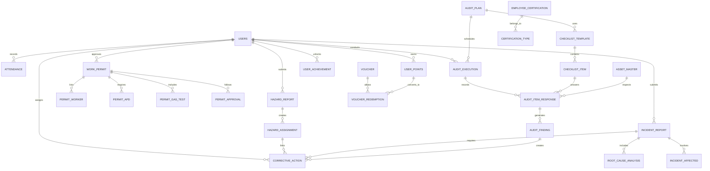

# DOKUMEN SPESIFIKASI KEBUTUHAN PERANGKAT LUNAK
## NURAGA - Integrated Safety Intelligence

**Versi:** 1.0  
**Tanggal:** 1 Juni 2026  
**Status:** Final  
**Standar:** IEEE 830-1998

---

## 1. PENDAHULUAN

### 1.1 Tujuan Dokumen

Dokumen Spesifikasi Kebutuhan Perangkat Lunak (Software Requirements Specification/SRS) ini menetapkan kebutuhan fungsional dan non-fungsional yang menyeluruh untuk Sistem Nuraga - Integrated Safety Intelligence. Dokumen ini dirancang untuk memberikan panduan kepada tim pengembang, stakeholder, dan quality assurance dalam memahami dan mengimplementasikan sistem secara menyeluruh dan terstruktur.

### 1.2 Ruang Lingkup Aplikasi

**Nama Sistem:** Nuraga - Integrated Safety Intelligence  
**Kategori:** Sistem Informasi Keselamatan dan Kesehatan Kerja (K3/HSE) Terintegrasi  
**Platform Deployment:** Web Application (Responsive)  
**Jenis Pengguna:** Multi-user dengan Role-Based Access Control (RBAC)

Nuraga adalah solusi digital komprehensif yang dirancang untuk mendigitalisasi, mengotomatisasi, dan mengoptimalkan seluruh aspek manajemen Keselamatan dan Kesehatan Kerja di lingkungan industri dan proyek konstruksi. Sistem ini bertujuan untuk mencapai zero accident dan meningkatkan budaya keselamatan kerja melalui integrasi teknologi AI, real-time analytics, dan collaborative workflows.

### 1.3 Konvensi Dokumen

- **[MUST]**: Kebutuhan yang wajib diimplementasikan
- **[SHOULD]**: Kebutuhan yang sangat disarankan untuk diimplementasikan
- **[MAY]**: Kebutuhan opsional untuk implementasi di masa depan
- *Teks miring*: Istilah teknis atau acuan khusus
- **Teks tebal**: Istilah penting atau heading
- `Monospace`: Nama field database, variabel, atau nilai spesifik

### 1.4 Audiens yang Dituju

1. **Pengembang Backend (Node.js/Express):** Untuk pemahaman API, business logic, dan database schema
2. **Pengembang Frontend (React.js):** Untuk UI/UX design specifications dan user workflow
3. **Database Administrator:** Untuk struktur database dan relationships
4. **Project Manager & Stakeholder:** Untuk scope, timeline, dan deliverables
5. **Quality Assurance Engineer:** Untuk test case design dan acceptance criteria
6. **Safety Officer/HSE Manager:** Untuk verifikasi compliance dengan standar K3 dan regulasi

### 1.5 Definisi, Akronim, dan Singkatan

| Singkatan | Definisi Lengkap |
|-----------|-----------------|
| **K3** | Keselamatan dan Kesehatan Kerja |
| **HSE** | Health, Safety, and Environment |
| **SRS** | Software Requirements Specification |
| **IEEE** | Institute of Electrical and Electronics Engineers |
| **RBAC** | Role-Based Access Control |
| **JWT** | JSON Web Token |
| **TRIR** | Total Recordable Incident Rate |
| **LTI** | Lost Time Injury |
| **APD** | Alat Pelindung Diri (Personal Protective Equipment/PPE) |
| **e-PTW** | Electronic Permit to Work |
| **QR** | Quick Response (kode barcode 2D) |
| **SOP** | Standard Operating Procedure |
| **API** | Application Programming Interface |
| **CRUD** | Create, Read, Update, Delete |
| **ORM** | Object-Relational Mapping |

---

## 2. DESKRIPSI KESELURUHAN SISTEM

### 2.1 Perspektif Produk

Nuraga adalah aplikasi web berbasis cloud yang berfungsi sebagai hub terpusat untuk manajemen K3 di seluruh organisasi. Sistem ini mengintegrasikan berbagai modul yang saling terhubung untuk memberikan visibility penuh terhadap:

- Status keselamatan kerja real-time
- Riwayat insiden dan hazard
- Compliance dengan regulasi K3
- Performance metrics dan trend analysis
- Kolaborasi antar peran dalam safety management

**Arsitektur Sistem:**
```
┌─────────────────────────────────────────┐
│       Frontend (React.js + Tailwind)    │
└──────────────────┬──────────────────────┘
                   │ (REST API)
┌──────────────────▼──────────────────────┐
│   Backend (Node.js + Express.js)        │
│  ├─ Authentication (JWT)                │
│  ├─ Business Logic Layer                │
│  ├─ Data Validation                     │
│  └─ API Endpoints                       │
└──────────────────┬──────────────────────┘
                   │ (SQL Query)
┌──────────────────▼──────────────────────┐
│  Database (PostgreSQL + Sequelize ORM)  │
│  ├─ User & Role Management              │
│  ├─ Historical Data & Audit Log         │
│  └─ Transactional Data                  │
└─────────────────────────────────────────┘
```

### 2.2 Karakteristik Pengguna

#### 2.2.1 Staff/Pekerja (Worker)
- **Capability Level:** Low to Medium
- **Akses:** Dashboard terbatas, submit reports, lihat status personal
- **Frekuensi Penggunaan:** Daily
- **Primary Tasks:** Absensi, lapor hazard/incident, lihat rekomendasi fatigue

#### 2.2.2 Supervisor (SPV)
- **Capability Level:** Medium
- **Akses:** Approve work permits, monitor tim, review reports
- **Frekuensi Penggunaan:** Daily
- **Primary Tasks:** Persetujuan bertingkat, monitoring kehadiran, oversight laporan

#### 2.2.3 Safety Officer (HSE)
- **Capability Level:** High
- **Akses:** Semua fitur, generate analytics, set policies
- **Frekuensi Penggunaan:** Daily
- **Primary Tasks:** Audit, approve permits, analyze trends, manage certifications

#### 2.2.4 Manager/Direktur
- **Capability Level:** Medium
- **Akses:** Dashboard strategis, reports, approval final
- **Frekuensi Penggunaan:** 2-3x per minggu
- **Primary Tasks:** Approval final, review metrics, strategic decisions

### 2.3 Lingkungan Operasional

- **Platform:** Web-based, responsive untuk desktop dan mobile
- **Browser Support:** Chrome v90+, Firefox v88+, Safari v14+, Edge v90+
- **Network:** Internet connectivity required (min. 1 Mbps)
- **Deployment:** Cloud infrastructure (dapat di-host on-premise jika diperlukan)
- **Operating Hours:** 24/7 availability dengan scheduled maintenance window

### 2.4 Asumsi dan Dependensi

#### Asumsi Teknis
1. PostgreSQL v12+ tersedia dan dikonfigurasi dengan baik
2. Node.js runtime v16+ terinstal di server backend
3. Browser modern tersedia untuk semua end-user
4. Network connectivity stabil untuk semua lokasi operasional
5. Storage capacity minimal 100 GB untuk historical data dan uploads

#### Asumsi Organisasi
1. Setiap pengguna memiliki unique identifier dan email address
2. Struktur organisasi sudah defined (Staff → SPV → HSE → Manager)
3. Kebijakan K3 sudah documented dan ready untuk digitalisasi
4. Budget untuk maintenance dan upgrade sudah diallokasikan

#### Dependensi Eksternal
1. Email service provider (untuk notifikasi dan recovery)
2. SMS gateway (untuk emergency alerts)
3. WhatsApp Business API (untuk notifikasi push)
4. File storage service (untuk dokumen uploads)
5. Keamanan data center dan backup infrastructure

#### Non-Functional Dependencies
1. Sistem harus mendukung integrasi dengan payroll system existing (API future)
2. Sistem harus kompatibel dengan QR code scanner devices
3. Sistem dapat diintegrasikan dengan safety equipment (IoT sensors) di masa depan

---

## 3. FITUR SISTEM & KEBUTUHAN FUNGSIONAL

### 3.1 MODUL 1: DASHBOARD & ANALYTICS

#### 3.1.1 Deskripsi

Dashboard adalah landing page utama setelah login yang menampilkan overview keselamatan kerja secara real-time. Dashboard harus dinamis berdasarkan role pengguna dan menyajikan key performance indicators (KPI) yang relevan dengan metrik K3 internasional.

#### 3.1.2 Kebutuhan Fungsional

**FR-1.1.1 [MUST]** Sistem harus menampilkan KPI utama pada dashboard:
- **TRIR (Total Recordable Incident Rate):** Dihitung sebagai (Jumlah insiden recordable × 200.000) / Total jam kerja
- **LTI Rate (Lost Time Injury Rate):** Dihitung sebagai (Jumlah LTI × 200.000) / Total jam kerja
- **Days Since Last Accident (DLSA):** Jumlah hari tanpa insiden recordable
- **Safety Compliance Score:** Persentase compliance dari checklist audit rutin

**FR-1.1.2 [MUST]** Sistem harus menyediakan visualisasi grafik dengan karakteristik:
- Trend line TRIR dan LTI dalam 12 bulan terakhir
- Distribution chart insiden berdasarkan kategori (Medical, Fire, Chemical, Evacuation)
- Pie chart hazard distribution berdasarkan risk level (Low/Medium/High)
- Bar chart top 5 hazard categories dan top 5 incident types
- Heatmap jam kerja dengan kejadian insiden (untuk pola analysis)

**FR-1.1.3 [MUST]** Dashboard harus menampilkan status real-time:
- Jumlah pekerja on-site hari ini
- Jumlah work permits aktif
- Open incidents/hazards yang require immediate action
- Alert notifikasi untuk events kritis (emergency, high-risk permits)

**FR-1.1.4 [SHOULD]** Sistem harus menyediakan predictive analytics:
- Prediksi TRIR untuk quarter berikutnya berdasarkan trend
- Identifikasi area/lokasi dengan risk level tertinggi
- Machine learning-based recommendation untuk preventive actions

**FR-1.1.5 [MUST]** Role-based dashboard customization:
- Staff: Hanya lihat KPI umum, status fatigue personal, scheduled permits
- SPV: Tambahan tim performance, pending approvals
- HSE: Access semua dashboard, deep analytics, trend forecasting
- Manager: Executive summary, high-level metrics, strategic trends

**FR-1.1.6 [MUST]** Sistem harus menyediakan export functionality:
- Export dashboard snapshot ke PDF format
- Export grafik ke image format (PNG, SVG)
- Export raw data ke CSV untuk further analysis

#### 3.1.3 Data yang Ditampilkan

```
Dashboard Data Model:
├─ KPI Metrics (calculated from Incident/Hazard records)
├─ Historical Time Series (12-month data)
├─ Real-time Status (today's attendance, active permits)
├─ Alert & Notification (pending approvals, critical events)
└─ User-specific Customization (widget preferences)
```

---

### 3.2 MODUL 2: ATTENDANCE & FATIGUE AI

#### 3.2.1 Deskripsi

Modul Absensi dan Monitoring Kelelahan mengintegrasikan sistem pencatatan kehadiran tradisional dengan AI-powered fatigue assessment. Sistem menganalisis pola tidur, jam kerja, dan stress level untuk memberikan rekomendasi fatigue status dan work capacity.

#### 3.2.2 Kebutuhan Fungsional

**FR-2.1.1 [MUST]** Sistem harus mencatat attendance dengan akurasi waktu:
- Fitur Check-In pada saat tiba di lokasi kerja
- Fitur Check-Out pada saat meninggalkan lokasi kerja
- Recording timestamp presisi ke second (00:00:00)
- Lokasi geografis capture (latitude/longitude) menggunakan geolocation browser
- Foto/selfie verification untuk mencegah proxy attendance [SHOULD]

**FR-2.1.2 [MUST]** Sistem harus mengumpulkan data fatigue personal:
- Daily input form untuk jam tidur malam sebelumnya (dalam format HH:MM)
- Stress level self-assessment (skala 1-10)
- Physical fatigue self-assessment (skala 1-10)
- Mental fatigue self-assessment (skala 1-10)
- Medical condition/complaints text field (opsional)

**FR-2.1.3 [MUST]** Sistem harus menghitung Fatigue Risk Index berdasarkan formula:
```
Fatigue Risk Index = (Sleep Quality Score × 0.35) + 
                     (Stress Level × 0.25) + 
                     (Physical Fatigue × 0.20) + 
                     (Mental Fatigue × 0.20)
```
- Kategori: GREEN (0-30, Safe to work), YELLOW (31-60, Monitor closely), RED (61-100, Not fit to work)

**FR-2.1.4 [MUST]** Sistem harus menyediakan Fatigue Status pada attendance record:
- **GREEN (Safe):** Rekomendasi normal duties
- **YELLOW (Caution):** Rekomendasi reduced workload, paired with buddy, frequent breaks
- **RED (Critical):** Rekomendasi tidak bekerja, mandatory rest, medical consultation

**FR-2.1.5 [MUST]** Sistem harus implement notifikasi otomatis:
- Alert ke Supervisor jika staff status RED
- Alert ke HSE Officer untuk tracking
- Recommendation message ke staff dengan saran istirahat dan recovery

**FR-2.1.6 [SHOULD]** Sistem harus tracking overtime dan shift pattern:
- Cumulative hours per week/month
- Shift rotation analysis (early/night shift impact)
- Recommendation untuk mandatory rest days berdasarkan hours worked

**FR-2.1.7 [MUST]** Attendance record harus mencakup:
- User ID dan Name
- Date (YYYY-MM-DD)
- Check-in time, Check-out time
- Duration worked (auto-calculated)
- Location (geolocation data)
- Fatigue assessment data
- Status (PRESENT/ABSENT/LEAVE/SICK)
- Approval status (PENDING/APPROVED/REJECTED)

**FR-2.1.8 [MUST]** Laporan Absensi Bulanan:
- Daftar lengkap kehadiran per employee per bulan
- Summary: present, absent, leave, sick days
- Cumulative fatigue trend
- Highlight pattern anomali (excessive overtime, chronic fatigue)

#### 3.2.3 Data Model

```
Attendance Record:
├─ attendance_id (PK)
├─ user_id (FK)
├─ date
├─ check_in_time, check_out_time
├─ duration_worked (calculated)
├─ location_latitude, location_longitude
├─ sleep_hours
├─ stress_level, physical_fatigue, mental_fatigue
├─ fatigue_risk_index (calculated)
├─ fatigue_status (ENUM: GREEN, YELLOW, RED)
├─ status (ENUM: PRESENT, ABSENT, LEAVE, SICK)
├─ approval_status
├─ created_at, updated_at
└─ notes (optional medical info)
```

---

### 3.3 MODUL 3: WORK PERMITS (e-PTW)

#### 3.3.1 Deskripsi

Work Permit to Work (e-PTW) adalah sistem elektronik untuk mengelola izin kerja khusus dan berbahaya. Sistem mengimplementasikan alur approval bertingkat dengan validasi hazard assessment dan APD yang komprehensif.

#### 3.3.2 Kebutuhan Fungsional

**FR-3.1.1 [MUST]** Work Permit harus memiliki struktur approval workflow:
```
DRAFT → SPV Approval → HSE Review → Manager Approval → ACTIVE → EXPIRED/CLOSED
```
- Setiap stage harus memiliki deadline dan notifikasi
- Ability untuk reject dengan mandatory reason/comment
- Rollback capability ke stage sebelumnya untuk revision

**FR-3.1.2 [MUST]** Setiap Work Permit harus mencakup informasi:
- **Basic Information:**
  - Permit ID (auto-generated format: PTW-YYYY-MM-DD-XXXX)
  - Permit Type (Confined Space, Hot Work, Electrical, Height Work, Excavation, Chemical Handling, dll)
  - Issue Date dan Valid Date (date range)
  - Location/Area
  - Work Description (detailed task description)
  - Start Time dan End Time (time range per hari)

- **Hazard Assessment:**
  - Identified hazards (multi-select dengan checkbox)
  - Risk level per hazard (Low/Medium/High)
  - Control measures (mitigation strategies)
  - Additional safety requirements
  - Pre-work safety briefing checklist (MUST be signed by all workers)

- **Manpower & APD:**
  - List of authorized workers (dengan name, ID, signature field)
  - Job role per worker (Foreman, Operator, Spotter, etc)
  - Required APD (multi-select dari APD master list)
  - APD inspection log (condition status: OK/DAMAGED/EXPIRED)
  - Safety equipment required (harness, ladder, extinguisher, etc)

- **Gas Test & Environmental:**
  - Gas detection result (O2, LEL, H2S levels dengan normal range)
  - Test timestamp dan tester name
  - Environmental condition (temperature, weather, humidity)
  - Permit validity condition (gas test valid untuk 8 jam atau sampai work selesai)

- **Approval Signatures:**
  - SPV approval dengan signature (digital/electronic)
  - HSE Officer approval dengan signature
  - Manager final approval dengan signature
  - Revoke capability dengan reason

**FR-3.1.3 [MUST]** Sistem harus menyediakan permit search dan filtering:
- Filter by Status (Draft, Pending Approval, Active, Expired, Closed)
- Filter by Permit Type
- Filter by Location/Area
- Filter by Date Range
- Search by Permit ID, Worker Name
- Sort by Issue Date, Expiry Date, Risk Level

**FR-3.1.4 [MUST]** Sistem harus track permit history:
- Audit trail untuk setiap perubahan status
- Version control untuk setiap revision
- Log approval timestamps dan approver identities
- Change log untuk field-field penting (hazard, APD, workers)

**FR-3.1.5 [SHOULD]** Sistem harus menyediakan smart recommendations:
- Suggestion of typical hazards berdasarkan Permit Type
- Suggestion APD berdasarkan identified hazards
- Suggestion control measures dari historical permits

**FR-3.1.6 [MUST]** Sistem harus implement permit lifecycle management:
- Auto-expiration pada validity end date
- Reminder notifikasi 1 hari sebelum expiry
- Permit closure dengan completion report
- Extension capability dengan re-validation (max 2x extension per permit)

**FR-3.1.7 [MUST]** Work Permit Status Dashboard:
- Display all active permits untuk HSE Officer
- Pending approval permits dengan responsible approver
- Expired permits dengan list of workers yang perlu briefing
- Historical closed permits dengan completion statistics

**FR-3.1.8 [MUST]** Reporting & Analytics:
- Permit issuance rate dan trend
- Hazard frequency distribution dari permits
- Average approval time per stage
- APD usage statistics
- Compliance rate dengan permit requirements

#### 3.3.3 Data Model

```
WorkPermit:
├─ permit_id (PK)
├─ permit_type (ENUM)
├─ location, work_description
├─ issue_date, valid_from, valid_to
├─ status (ENUM: DRAFT, PENDING, ACTIVE, EXPIRED, CLOSED)
├─ created_by_user_id (FK)
├─ created_at, updated_at

PermitHazard (junction table):
├─ permit_id (FK)
├─ hazard_id (FK)
├─ risk_level (ENUM)
└─ control_measures (text)

PermitWorker (junction table):
├─ permit_id (FK)
├─ user_id (FK)
├─ job_role
└─ signed_at (timestamp)

PermitAPD (junction table):
├─ permit_id (FK)
├─ apd_id (FK)
└─ condition_status (ENUM)

PermitGasTest:
├─ test_id (PK)
├─ permit_id (FK)
├─ oxygen_level, lel_level, h2s_level
├─ tested_by_user_id (FK)
├─ tested_at
└─ valid_until

PermitApproval (audit trail):
├─ approval_id (PK)
├─ permit_id (FK)
├─ approver_user_id (FK)
├─ approval_stage (ENUM)
├─ status (ENUM: APPROVED, REJECTED)
├─ reason_if_rejected
└─ approved_at
```

---

### 3.4 MODUL 4: HAZARD REPORTS

#### 3.4.1 Deskripsi

Modul Pelaporan Hazard memungkinkan setiap pekerja melaporkan potensi bahaya di lapangan secara cepat dan mudah. Sistem akan track status penyelesaian dan provide analytics untuk preventive action planning.

#### 3.4.2 Kebutuhan Fungsional

**FR-4.1.1 [MUST]** Sistem harus menyediakan hazard report form dengan fields:
- **Report Identification:**
  - Report ID (auto-generated: HZD-YYYY-MM-DD-XXXX)
  - Report Date & Time (auto-captured dari system)
  - Reporter (auto-filled dari logged-in user)
  - Location/Area (dengan geographic markers jika possible)

- **Hazard Description:**
  - Category (multi-select: Electrical Hazard, Chemical Spill, Unsafe Act, Unsafe Condition, Ergonomic Hazard, Fire Risk, dll)
  - Description (detailed text, min 20 characters)
  - Photos/Attachments (up to 5 images, max 5MB per image)
  - Video evidence [SHOULD]

- **Risk Assessment:**
  - Risk Level self-assessment (Low/Medium/High)
  - Potential Consequence (injury type, severity)
  - Number of people affected
  - Estimated frequency jika tidak ditangani

- **Immediate Action:**
  - Corrective action taken oleh reporter
  - Temporary measure status
  - Escalation to Supervisor [SHOULD] (immediate notification)

**FR-4.1.2 [MUST]** Sistem harus implement hazard status lifecycle:
```
OPEN → ASSIGNED → IN PROGRESS → RESOLVED → CLOSED
```
- Initial status: OPEN (after report submission)
- Supervisor dapat ASSIGN ke specific person/team
- Assigned person update status ke IN PROGRESS dengan action plan
- Reporter atau HSE verify RESOLVED status
- Final CLOSED dengan verification completion
- Ability untuk RE-OPEN jika issue resurface

**FR-4.1.3 [MUST]** Sistem harus menyediakan hazard assignment:
- Assign hazard ke specific person/team dengan deadline
- Add corrective action checklist
- Timeline tracking dan progress monitoring
- Attachment upload untuk solution proof (photos, documents)
- Digital signature dari person-in-charge setelah completion

**FR-4.1.4 [MUST]** Hazard tracking dashboard:
- List of all open hazards dengan age (days open)
- Hazards by risk level (HIGH hazards priority)
- Hazard by category dengan distribution chart
- HIGH risk hazards harus have visible escalation status
- Hazards overdue (deadline passed) harus highlighted

**FR-4.1.5 [MUST]** Sistem harus mengimplementasikan alert & notification:
- Real-time notification ke Supervisor saat HIGH risk report
- Daily summary ke HSE Officer untuk pending hazards
- Reminder sebelum deadline untuk assigned hazards
- Notification ke reporter tentang status updates

**FR-4.1.6 [SHOULD]** Analytics & Reporting:
- Hazard trend analysis (daily/weekly/monthly open hazards)
- Most common hazard categories dengan historical data
- Average resolution time per category
- Correlation antara hazards dan incidents (hazard yang tidak ditangani → incident)
- Hotspot mapping (lokasi/area dengan hazard tertinggi)

**FR-4.1.7 [MUST]** Hazard Details View:
- Full hazard report display dengan history
- Audit trail dari semua status changes dan comments
- Timeline view dari open → closed
- All assigned corrective actions dengan deadlines
- Resolution details dan validation proof

**FR-4.1.8 [MUST]** Bulk operations:
- Bulk reassign hazards ke person/team lain
- Bulk update status (in progress, resolved)
- Bulk export hazard reports ke PDF/Excel

#### 3.4.3 Data Model

```
HazardReport:
├─ hazard_id (PK)
├─ report_id (unique)
├─ reporter_user_id (FK)
├─ location
├─ category (ENUM)
├─ description, risk_level
├─ status (ENUM)
├─ created_at, updated_at
└─ resolved_at (nullable)

HazardCategory (master data):
├─ category_id (PK)
├─ category_name
└─ severity_baseline

HazardAttachment:
├─ attachment_id (PK)
├─ hazard_id (FK)
├─ file_path, file_size
└─ uploaded_at

HazardAssignment:
├─ assignment_id (PK)
├─ hazard_id (FK)
├─ assigned_to_user_id (FK)
├─ assigned_by_user_id (FK)
├─ assigned_date, deadline
└─ status (ENUM)

HazardHistory (audit trail):
├─ history_id (PK)
├─ hazard_id (FK)
├─ action (ENUM: CREATED, STATUS_CHANGED, ASSIGNED, etc)
├─ old_value, new_value
├─ changed_by_user_id (FK)
└─ changed_at
```

---

### 3.5 MODUL 5: INCIDENT REPORTS

#### 3.5.1 Deskripsi

Modul Incident Report mengelola pelaporan kecelakaan kerja dengan akurasi tinggi, including root cause analysis otomatis menggunakan metode 5-Whys, estimasi loss cost, dan follow-up corrective action tracking.

#### 3.5.2 Kebutuhan Fungsional

**FR-5.1.1 [MUST]** Incident Report Form mencakup:
- **Incident Details:**
  - Incident ID (auto-generated: INC-YYYY-MM-DD-XXXX)
  - Date & Time of Incident (precise timestamp)
  - Location/Area
  - Incident Category (Medical Injury, Fire, Chemical Exposure, Equipment Failure, Environmental, dll)
  - Incident Type (Minor, Major, Serious, Fatal) - auto-assess based on consequences

- **Involved Personnel:**
  - Affected employee(s) name, ID, job role
  - Injured body part/organ (jika applicable)
  - Injury type (cut, fracture, burn, poisoning, etc)
  - Injury severity (First Aid, Medical Treatment, Hospitalization, Permanent Disability, Fatality)

- **Incident Narrative:**
  - What happened (detailed description)
  - How it happened (sequence of events)
  - Why it happened (preliminary causes)
  - Witnesses (names & contact, dapat assign untuk witness statement)
  - Photos/Videos (up to 10 items)
  - Preliminary immediate action taken

- **Financial Impact Assessment:**
  - Medical cost (treatment, hospitalization)
  - Equipment damage cost
  - Production loss cost
  - Worker compensation cost
  - Total Loss Cost (auto-sum) dengan business impact rating

**FR-5.1.2 [MUST]** Sistem harus implement 5-Whys Root Cause Analysis:
```
Incident → Why 1? → Why 2? → Why 3? → Why 4? → Why 5? → Root Cause
```
- Interactive wizard untuk guiding 5-Whys process
- System suggest Why level recommendations berdasarkan incident type
- Dokumentasi setiap why level dengan supporting evidence
- Final root cause statement generation
- Auto-flag untuk systemic/process root causes (bukan hanya individual)

**FR-5.1.3 [MUST]** Incident Severity & Classification:
- **Minor:** First aid, no lost time (Minor Injury)
- **Major:** Medical treatment, some lost time (Reportable Injury)
- **Serious:** Hospitalization, extended lost time (Lost Time Injury/LTI)
- **Fatal:** Fatality (MUST immediate escalation)

System auto-classifies berdasarkan injury type dan treatment level.

**FR-5.1.4 [MUST]** Incident Approval Workflow:
```
REPORTED → Department SPV Approval → HSE Investigation → Manager Review → CLOSED
```
- Initial report oleh witness/affected person
- SPV acknowledge dan provide initial investigation
- HSE conduct formal investigation dengan evidence collection
- Manager review root cause analysis dan corrective action plan
- Final closure dengan lessons learned documentation

**FR-5.1.5 [MUST]** Corrective Actions Linked to Incidents:
- Auto-generate corrective action items dari identified root causes
- Define responsible person, deadline, dan success criteria
- Progress tracking integrated dengan Corrective Action modul
- Closure verification sebelum incident dapat di-close

**FR-5.1.6 [MUST]** Incident Investigation Report:
- Structured template untuk formal investigation
- Evidence collection documentation (witness statements, photos, equipment inspection)
- Timeline reconstruction
- System failure analysis (jika applicable)
- HSE Officer digital signature pada investigation completion

**FR-5.1.7 [MUST]** Notifications & Escalation:
- IMMEDIATE notification ke HSE Officer & Manager untuk SERIOUS/FATAL incidents
- SMS/WhatsApp alert untuk emergency incidents
- Daily summary untuk pending investigations
- Reminder sebelum deadline untuk investigation completion

**FR-5.1.8 [MUST]** Analytics & Trend:
- Incident rate trending (monthly, quarterly, annual)
- Incident distribution by type, location, shift
- LTI tracking dan TRIR calculation contribution
- Root cause frequency analysis (top causes)
- Corrective action effectiveness tracking (incident resurface rate)
- Correlation analysis: hazard reports → incidents (conversion rate)

**FR-5.1.9 [MUST]** Confidentiality & Access Control:
- Sensitive data (affected employee details) protected dengan restricted access
- Only authorized roles dapat view full incident details
- Investigation report hanya accessible ke HSE + Manager
- Worker dapat view own incident report dan corrective actions

**FR-5.1.10 [SHOULD]** Incident Prevention:
- AI-based recommendation untuk similar hazards prevention
- Lessons learned documentation
- Automatic incident alert jika pattern detected (e.g., 2nd incident same type in 30 days)
- Near-miss tracking (dangerous situations yang avoided)

#### 3.5.3 Data Model

```
IncidentReport:
├─ incident_id (PK)
├─ report_id (unique)
├─ date_time
├─ location, category, type
├─ description, narrative
├─ severity (ENUM)
├─ status (ENUM)
├─ total_loss_cost
├─ reported_by_user_id (FK)
├─ investigating_officer_id (FK)
├─ created_at, updated_at
└─ closed_at (nullable)

IncidentAffected (affected personnel):
├─ affected_id (PK)
├─ incident_id (FK)
├─ user_id (FK)
├─ injury_type, injured_part
├─ injury_severity
└─ treatment_required

RootCauseAnalysis:
├─ analysis_id (PK)
├─ incident_id (FK)
├─ why_1, why_2, why_3, why_4, why_5
├─ root_cause_statement
├─ analysis_by_user_id (FK)
└─ analyzed_at

IncidentCorrective (junction to Corrective Action):
├─ incident_id (FK)
├─ corrective_action_id (FK)
└─ created_at

IncidentAttachment:
├─ attachment_id (PK)
├─ incident_id (FK)
├─ file_path, file_type
└─ uploaded_at

IncidentHistory (audit trail):
├─ history_id (PK)
├─ incident_id (FK)
├─ action (ENUM)
├─ details (JSON)
├─ changed_by_user_id (FK)
└─ changed_at
```

---

### 3.6 MODUL 6: EMERGENCY RESPONSE (SOS)

#### 3.6.1 Deskripsi

Modul Emergency Response menyediakan sistem SOS (emergency button) yang memungkinkan pekerja melaporkan keadaan darurat dengan cepat. Sistem harus memfasilitasi koordinasi response team dan track emergency resolution time.

#### 3.6.2 Kebutuhan Fungsional

**FR-6.1.1 [MUST]** Emergency Button UI/UX:
- Large, easily accessible SOS button di mobile app dan web dashboard
- Single tap/click untuk activate emergency
- Clear visual and audio feedback (vibration, sound alert)
- No additional confirmation prompt (immediate action)
- Prominent display dengan red color (#DC2626)

**FR-6.1.2 [MUST]** Emergency Type Selection:
```
Medical → First Aid, Injury, Health Crisis, Mental Health
Fire → Fire in Building, Equipment Fire, Chemical Fire
Chemical → Gas Leak, Chemical Spill, Toxic Exposure
Evacuation → Earthquake, Security Threat, Structural Hazard, Other
```
- Quick selection interface after SOS button pressed
- Predefined templates untuk each emergency type

**FR-6.1.3 [MUST]** Emergency Activation Workflow:
1. User press SOS button → Auto-capture location (geolocation)
2. System select emergency type (Medical/Fire/Chemical/Evacuation)
3. Optional: Add voice message atau text description
4. System immediately notify Emergency Response Team:
   - HSE Officer (highest priority)
   - Manager
   - Selected emergency responders
5. System track response time (time dari activation hingga first responder arrival)

**FR-6.1.4 [MUST]** Automatic System Actions upon Emergency:
- Lock down nearby work areas (visual notification ke semua workers)
- Activate automated alert system (alarm, siren, flashing lights jika terintegrasi)
- Send SMS/WhatsApp push notification ke responders dengan:
  - Emergency type
  - Location (map link)
  - Affected personnel info (jika known)
  - Quick action buttons (Acknowledge, Responding, Resolved)
- Activate incident tracking (auto-create incident record)

**FR-6.1.5 [MUST]** Emergency Response Coordination:
- Real-time status update untuk responding team
- Live location tracking dari emergency location di map
- Estimated arrival time untuk nearest responders
- Emergency hotline connection (click-to-call feature)
- Virtual communication channel (group chat untuk responders)

**FR-6.1.6 [MUST]** Emergency Resolution:
- First responder update status → Responding, On-Site, Under-Control, Resolved
- Responder dapat add photos/notes dari emergency scene
- Final closure dengan damage assessment dan corrective measures initiated
- Timeline capture: activation time → first response → resolution time

**FR-6.1.7 [MUST]** Emergency Dashboard:
- Active emergencies list dengan real-time status
- Emergency history dengan response metrics
- Response time analytics (average time for each type)
- Map view showing emergency locations
- Responder availability tracking

**FR-6.1.8 [MUST]** Post-Emergency Actions:
- Auto-link ke Incident Report modul (detailed investigation)
- Auto-generate Hazard Report jika applicable
- Post-incident review dengan response team
- Corrective action generation based on incident root cause

**FR-6.1.9 [SHOULD]** Integration dengan Emergency Services:
- Auto-dial emergency hotline (911, 112, local equivalent)
- Auto-send location coordinates untuk GPS tracking oleh authorities
- Integration dengan local emergency response team (jika API available)

**FR-6.1.10 [MUST]** Emergency Drill Capability:
- Mock emergency activation untuk training purposes
- System harus track drill activations separately dari real emergencies
- Drill mode clear indication (e.g., "DRILL MODE" label)
- Response time measurement untuk drill effectiveness

#### 3.6.3 Data Model

```
EmergencyAlert:
├─ alert_id (PK)
├─ activation_time (timestamp)
├─ emergency_type (ENUM)
├─ location_latitude, location_longitude
├─ is_drill (boolean)
├─ activated_by_user_id (FK)
├─ description (optional)
├─ status (ENUM: ACTIVE, RESPONDING, RESOLVED, CLOSED)
└─ closed_at (nullable)

EmergencyResponder (assigned responders):
├─ responder_id (PK)
├─ alert_id (FK)
├─ user_id (FK)
├─ notification_time
├─ acknowledgement_time (nullable)
├─ arrival_time (nullable)
└─ status (ENUM)

EmergencyAttachment:
├─ attachment_id (PK)
├─ alert_id (FK)
├─ file_path (photo/voice)
└─ uploaded_at

EmergencyTimeline (audit trail):
├─ timeline_id (PK)
├─ alert_id (FK)
├─ event (ENUM: ACTIVATED, RESPONDING, ARRIVED, RESOLVED)
├─ timestamp
├─ notes (optional)
└─ updated_by_user_id (FK)
```

---

### 3.7 MODUL 7: SAFETY AUDITS

#### 3.7.1 Deskripsi

Modul Safety Audits memfasilitasi inspeksi K3 rutin menggunakan checklist structured dan QR code scanning untuk aset management. Sistem track audit history dan generate compliance reports.

#### 3.7.2 Kebutuhan Fungsional

**FR-7.1.1 [MUST]** Audit Scheduling & Setup:
- Create audit plan dengan frequency (daily, weekly, monthly, quarterly, annual)
- Assign audit checklist template ke specific area/location
- Schedule audit date & time dengan responsible auditor
- Allow flexible scheduling dengan rescheduling capability
- Reminder notification kepada assigned auditor sebelum audit date

**FR-7.1.2 [MUST]** Audit Checklist Structure:
- Master checklist templates per audit type (e.g., General K3, Confined Space, Hot Work, etc)
- Checklist items dengan:
  - Item number dan description
  - Category (Facility, Equipment, Personnel, Process, Documentation, etc)
  - Compliance standard reference (e.g., SNI, OSHA, ISO standards)
  - Priority level (Critical, High, Medium, Low)
  - Expected evidence type (photo, document, verbal verification)
  - Yes/No question atau rating scale (1-5)

**FR-7.1.3 [MUST]** Audit Execution dengan QR Code:
- Mobile-optimized audit form dengan real-time progress
- QR code scanning untuk asset identification:
  - Scan aset QR code → Auto-populate asset info (serial number, location, last maintenance date)
  - Verify item condition berdasarkan physical inspection
  - Capture photos sebagai evidence
  - Record condition status (OK, DAMAGED, EXPIRED, MAINTENANCE REQUIRED)
- Manual input option jika QR code unavailable

**FR-7.1.4 [MUST]** Audit Form Features:
- Progress indicator (X of Y items completed)
- Comment field untuk non-compliance findings
- Photo attachment untuk evidence (up to 5 per item)
- Signature field dari auditor pada completion
- Timestamp auto-capture

**FR-7.1.5 [MUST]** Audit Findings & Non-Compliance:
- System auto-identify non-compliant items (answered "No" atau rated < 3)
- Generate findings list dengan:
  - Finding ID
  - Item tidak sesuai
  - Category problem (safety risk, maintenance issue, documentation gap)
  - Risk level (Low/Medium/High)
  - Recommended corrective action
  - Deadline untuk action
- Auto-link ke Corrective Action modul untuk tracking

**FR-7.1.6 [MUST]** Audit Report Generation:
- Comprehensive audit report dengan:
  - Audit date, location, auditor name
  - Overall compliance score (percentage)
  - Summary findings (total findings by risk level)
  - Detailed findings dengan photos dan recommendations
  - Corrective action items dengan timeline
  - Digital signature dari auditor dan HSE Officer
- Export to PDF format
- Sign-off capability dari area manager

**FR-7.1.7 [MUST]** Audit Tracking Dashboard:
- Schedule view (upcoming audits, overdue audits)
- Completed audits dengan results
- Open findings dari audits (by risk level)
- Corrective action status dari audit findings
- Trend analysis (compliance score over time per location)

**FR-7.1.8 [SHOULD]** Asset Management Integration:
- Master asset database (equipment, machinery, facilities)
- Asset maintenance history linked to audit findings
- Preventive maintenance scheduling based on audit results
- Asset decommissioning tracking

**FR-7.1.9 [MUST]** Compliance Reporting:
- Monthly audit summary per location
- Quarterly compliance trend analysis
- Year-to-date compliance scorecard
- Non-compliance trending (repeated findings per item)
- Auditor performance metrics (finding frequency)

**FR-7.1.10 [SHOULD]** Mobile Audit Offline Mode:
- Download checklist untuk offline completion
- Offline photo capture dan form filling
- Auto-sync saat internet connection restored
- Conflict resolution jika duplicate audit submission

#### 3.7.3 Data Model

```
AuditPlan:
├─ plan_id (PK)
├─ location
├─ checklist_template_id (FK)
├─ scheduled_date, scheduled_time
├─ assigned_auditor_user_id (FK)
├─ frequency (ENUM)
├─ status (ENUM: SCHEDULED, IN_PROGRESS, COMPLETED, OVERDUE)
└─ created_at

ChecklistTemplate (master data):
├─ template_id (PK)
├─ template_name, audit_type
└─ created_at

ChecklistItem (master data):
├─ item_id (PK)
├─ template_id (FK)
├─ item_number, description
├─ category, priority
├─ standard_reference
└─ item_type (YES_NO, RATING, SCALE)

AuditExecution:
├─ execution_id (PK)
├─ plan_id (FK)
├─ start_time, end_time
├─ executed_by_user_id (FK)
├─ status (ENUM)
└─ overall_compliance_score

AuditItemResponse:
├─ response_id (PK)
├─ execution_id (FK)
├─ item_id (FK)
├─ response (ENUM: YES, NO, PARTIAL, or NUMERIC)
├─ comment
└─ photo_path

AuditFinding:
├─ finding_id (PK)
├─ execution_id (FK)
├─ item_id (FK)
├─ risk_level (ENUM)
├─ recommended_action
├─ deadline
├─ corrective_action_id (FK, nullable)
└─ created_at

AssetMaster:
├─ asset_id (PK)
├─ asset_code, asset_name
├─ qr_code_id (unique)
├─ location, category
├─ last_maintenance_date
├─ status (ENUM)
└─ created_at
```

---

### 3.8 MODUL 8: CORRECTIVE ACTIONS

#### 3.8.1 Deskripsi

Modul Corrective Actions mengelola semua tindakan perbaikan yang dihasilkan dari audit findings, incident investigations, atau hazard reports. Sistem track progress, deadline, dan responsibility dengan accountability penuh.

#### 3.8.2 Kebutuhan Fungsional

**FR-8.1.1 [MUST]** Corrective Action Creation:
- Auto-creation dari audit findings, incidents, hazards
- Manual creation option untuk proactive improvements
- Corrective Action ID: CA-YYYY-MM-DD-XXXX (auto-generated)
- Link ke originating record (audit/incident/hazard)
- Priority level: Critical, High, Medium, Low

**FR-8.1.2 [MUST]** Corrective Action Structure:
- **Problem Statement:**
  - Issue description (what needs to be fixed)
  - Root cause (linked dari incident 5-Whys atau audit finding)
  - Risk if not addressed

- **Corrective Action Plan:**
  - Action description (detailed steps)
  - Responsible person (assign ke specific individual)
  - Required resources (budget, materials, training)
  - Timeline: Start date, Target completion date
  - Success criteria (how to verify completion)

- **Implementation:**
  - Progress tracking (% complete)
  - Status: Open → In Progress → Completed → Verified → Closed
  - Action updates (comments, photo evidence)
  - Resource utilization tracking
  - Risk: Can mark "At Risk" jika deadline threatened

- **Verification:**
  - Completion verification oleh responsible person
  - Independent verification oleh HSE/Manager
  - Evidence documentation (photos, test results, certificates)
  - Follow-up inspection jika required

**FR-8.1.3 [MUST]** Corrective Action Workflow:
```
OPEN → ASSIGNED → IN_PROGRESS → COMPLETED → VERIFIED → CLOSED
```
- Status change notifications ke responsible person
- Escalation alerts jika approaching deadline
- Re-open capability jika verification failed (return ke IN_PROGRESS)

**FR-8.1.4 [MUST]** Tracking & Accountability:
- Dashboard showing all open corrective actions
- Filter by: Status, Priority, Responsible Person, Due Date, Origin (Audit/Incident/Hazard)
- Overdue corrective actions highlighted dengan red flag
- Responsible person notification untuk pending actions
- Audit trail untuk all status changes

**FR-8.1.5 [MUST]** Deadline Management:
- Set deadline dengan business days consideration
- Automatic reminder 3 days, 1 day before deadline
- Allow deadline extension dengan justification
- Track extension history (original vs extended deadline)
- Escalation to Manager jika extension requested

**FR-8.1.6 [MUST]** Effectiveness Tracking:
- Flag "Preventive" corrective action yang mengcegah future occurrence
- Track if origin incident/hazard resurface → indicates ineffective action
- Analytics: Corrective action completion rate
- Correlation: Completed CA vs incident/hazard reduction

**FR-8.1.7 [SHOULD]** Smart Assignment:
- Recommend responsible person berdasarkan expertise/role
- Suggest similar completed actions untuk reference
- Auto-notify related parties (e.g., supervisor dari responsible person)

**FR-8.1.8 [MUST]** Bulk Operations:
- Bulk status update (multiple CA at once)
- Bulk reassign actions
- Bulk extend deadlines dengan reason

**FR-8.1.9 [MUST]** Reporting:
- Corrective action completion statistics (by month, origin, category)
- Average completion time per category
- Responsible person performance (completion rate, timeliness)
- Cost tracking dari implemented actions (budget vs actual)

#### 3.8.3 Data Model

```
CorrectiveAction:
├─ action_id (PK)
├─ action_id_display (CA-YYYY-MM-DD-XXXX)
├─ origin_type (ENUM: AUDIT, INCIDENT, HAZARD)
├─ origin_id (references audit/incident/hazard)
├─ problem_statement
├─ root_cause
├─ action_description
├─ responsible_user_id (FK)
├─ priority (ENUM)
├─ start_date, target_completion_date
├─ actual_completion_date (nullable)
├─ status (ENUM)
├─ success_criteria
├─ is_preventive (boolean)
├─ created_by_user_id (FK)
├─ created_at, updated_at
└─ closed_at (nullable)

CAProgressUpdate:
├─ update_id (PK)
├─ action_id (FK)
├─ progress_percent
├─ status_update (text)
├─ photo_attachment (nullable)
├─ updated_by_user_id (FK)
└─ updated_at

CAVerification:
├─ verification_id (PK)
├─ action_id (FK)
├─ verified_by_user_id (FK)
├─ verification_date
├─ is_effective (boolean)
├─ evidence (text/attachment)
└─ notes

CADeadlineExtension:
├─ extension_id (PK)
├─ action_id (FK)
├─ original_deadline
├─ new_deadline
├─ extension_reason
├─ approved_by_user_id (FK)
└─ extended_at
```

---

### 3.9 MODUL 9: CERTIFICATIONS

#### 3.9.1 Deskripsi

Modul Certifications memantau dan manage sertifikasi/lisensi K3 dari pekerja. Sistem track tanggal expiry dan provide reminders untuk renewal planning.

#### 3.9.2 Kebutuhan Fungsional

**FR-9.1.1 [MUST]** Certification Master Data:
- Master list of certification types:
  - Ahli K3 Umum (3-year validity)
  - Ahli K3 Konstruksi (3-year validity)
  - Ahli K3 Pertambangan (3-year validity)
  - SIO (Safety Induction Officer) - Forklift (1-year validity)
  - SIO - Scaffolding (1-year validity)
  - First Aid Certificate (2-year validity)
  - Fire Safety (1-2 year validity)
  - Custom certifications per company requirement

**FR-9.1.2 [MUST]** Employee Certification Record:
- Certificate ID (auto-generated: CERT-XXXX-YYYY)
- Employee linked
- Certification type
- Issue date
- Expiry date
- Issuing authority
- Certificate document (PDF upload)
- Renewal history tracking

**FR-9.1.3 [MUST]** Expiry Monitoring:
- Dashboard showing certification status:
  - **ACTIVE:** Valid (green indicator)
  - **EXPIRING SOON:** 30 days before expiry (yellow indicator, alert)
  - **EXPIRED:** Past expiry date (red indicator, high alert)
  - **RENEWAL PENDING:** Submitted renewal, awaiting validation
- Filters: By employee, by cert type, by status
- Bulk view untuk entire organization certification status

**FR-9.1.4 [MUST]** Notification & Reminder:
- Auto-reminder kepada employee 60 days before expiry
- Reminder kepada HR/Manager 30 days before
- Notification kepada HSE Officer saat certification expired
- Email dengan renewal procedure instructions

**FR-9.1.5 [MUST]** Renewal Process:
- Employee request renewal dengan old certificate photo
- System validate against master database (check against Ministry records jika API available)
- Store renewal records dan track pending renewals
- Ability to upload new certificate upon completion
- Mark certificate as RENEWED dengan new expiry date

**FR-9.1.6 [MUST]** Certification Report:
- Export employee certifications status (per employee, per team, per department)
- Certification expiry calendar (visual timeline)
- Renewal pipeline (pending renewals, expected completion)
- Compliance status (% of employees dengan valid certs per role)
- Cost tracking untuk renewal programs

**FR-9.1.7 [SHOULD]** Training Recommendation:
- Auto-trigger training recommendation 6 months before expiry
- Link to training provider atau internal training schedule
- Track training completion linked to certification renewal

**FR-9.1.8 [MUST]** Access Control Integration:
- System dapat restrict system access untuk users dengan expired certifications [SHOULD]
- Alert manager jika critical role person has expired cert
- Restrict assignment untuk task requiring specific cert jika cert expired

#### 3.9.3 Data Model

```
CertificationType (master data):
├─ cert_type_id (PK)
├─ cert_name
├─ validity_years
├─ issuing_authority
└─ created_at

EmployeeCertification:
├─ cert_record_id (PK)
├─ cert_id_display (CERT-XXXX-YYYY)
├─ user_id (FK)
├─ cert_type_id (FK)
├─ issue_date, expiry_date
├─ certificate_document_path
├─ issuing_authority
├─ status (ENUM: ACTIVE, EXPIRING_SOON, EXPIRED, RENEWAL_PENDING)
├─ created_at
└─ updated_at

CertificationRenewal:
├─ renewal_id (PK)
├─ cert_record_id (FK)
├─ renewal_date
├─ new_certificate_path
├─ renewed_by_user_id (FK)
├─ old_expiry_date
├─ new_expiry_date
└─ created_at

CertificationAlert:
├─ alert_id (PK)
├─ cert_record_id (FK)
├─ alert_type (ENUM: 60_DAY, 30_DAY, EXPIRED)
├─ user_id (FK) [who should be alerted]
├─ sent_at
└─ acknowledged_at (nullable)
```

---

### 3.10 MODUL 10: GAMIFICATION & REWARDS

#### 3.10.1 Deskripsi

Modul Gamification memotivasi pekerja untuk aktif berkontribusi pada keselamatan kerja melalui sistem poin dan reward. Sistem mendorong pelaporan hazard, incident reporting, dan participation dalam safety program.

#### 3.10.2 Kebutuhan Fungsional

**FR-10.1.1 [MUST]** Points System:
- Point allocation untuk berbagai safety-related activities:
  - Report hazard: 5 points
  - Report incident: 3 points (less incentivized, incident adalah negative event)
  - Attend safety training: 10 points
  - Complete audit: 15 points (for auditors)
  - Certify/renew certification: 20 points
  - Perfect attendance (bulan full): 5 points
  - Zero fatigue status (3 hari GREEN): 3 points
  - Daily login ke system: 1 point

**FR-10.1.2 [MUST]** Leaderboard:
- Individual leaderboard (monthly, quarterly, yearly)
- Team leaderboard (aggregated points dari team members)
- Department leaderboard
- Show ranking dengan points total, activities count, achievements
- Display top performers dengan badges

**FR-10.1.3 [MUST]** Achievements & Badges:
- Badge system untuk milestone achievement:
  - "Safety Champion": 500+ points/month
  - "Hazard Hunter": 10+ hazard reports/month
  - "Perfect Attendance": Zero absences/month
  - "Guardian Angel": First to respond 3x emergency alerts
  - "Certified Expert": Multiple valid K3 certifications
  - "Clean Month": Zero incidents dalam bulan
  - Unlock custom achievements per organization

**FR-10.1.4 [MUST]** Rewards & Vouchers:
- Point redemption untuk merchandise/vouchers:
  - 50 points: Rp 50.000 voucher (mini-market, cafe, etc)
  - 100 points: Rp 100.000 voucher
  - 200 points: Rp 250.000 voucher
  - 500 points: Special merchandise (branded shirt, cap, water bottle, safety equipment)
  - Custom reward packages per organization
- Voucher tracking:
  - Issue date, expiry date
  - Redemption at partner merchants
  - Digital voucher code generation (QR code)

**FR-10.1.5 [MUST]** Point History & Transparency:
- Detailed point history untuk each employee:
  - Transaction date
  - Activity yang earn points
  - Points amount
  - Running balance
  - Full audit trail

**FR-10.1.6 [SHOULD]** Social Features:
- Achievement notification sharing (e.g., "Congratulations! John achieved Safety Champion badge!")
- Team celebration untuk milestone (e.g., "Team A reached 1000 points!")
- Recognition message feature (peer appreciation)
- Social engagement to drive healthy competition

**FR-10.1.7 [MUST]** Administrator Controls:
- Manual point adjustment (dengan reason & approval)
- Reward catalog management (point price, inventory)
- Leaderboard reset schedule (monthly/quarterly/yearly)
- Point multiplier campaigns (e.g., double points untuk hazard reports di high-risk area)
- Activity configuration (enable/disable activity types, adjust points)

**FR-10.1.8 [SHOULD]** Analytics:
- Engagement metrics (% active participants, average points/employee)
- Activity trend (which activities most popular)
- Reward redemption pattern
- Correlation antara gamification metrics dan actual safety metrics (incident reduction)

**FR-10.1.9 [MUST]** Fairness & Anti-Fraud:
- Prevent point gaming (e.g., duplicate reports, fake activities)
- Manual review untuk suspicious point activity
- Automated flag untuk unusual patterns
- Audit trail untuk all point allocations

#### 3.10.3 Data Model

```
PointActivity (master data):
├─ activity_id (PK)
├─ activity_type (ENUM)
├─ activity_name
├─ base_points
├─ activity_trigger (automatic/manual)
└─ created_at

UserPoints:
├─ point_transaction_id (PK)
├─ user_id (FK)
├─ activity_id (FK)
├─ points_earned
├─ reference_id (hazard/incident/cert ID)
├─ transaction_date
└─ created_at

UserPointBalance:
├─ balance_id (PK)
├─ user_id (FK)
├─ current_balance
├─ lifetime_points
└─ updated_at

Achievement (master data):
├─ achievement_id (PK)
├─ achievement_name
├─ achievement_description
├─ badge_image
├─ point_threshold
└─ created_at

UserAchievement:
├─ user_achievement_id (PK)
├─ user_id (FK)
├─ achievement_id (FK)
├─ unlocked_date
└─ created_at

Voucher (master data):
├─ voucher_id (PK)
├─ voucher_code (unique)
├─ points_required
├─ voucher_value
├─ validity_period
├─ partner_name
└─ created_at

VoucherRedemption:
├─ redemption_id (PK)
├─ user_id (FK)
├─ voucher_id (FK)
├─ redemption_date
├─ expiry_date
├─ status (ENUM: ACTIVE, REDEEMED, EXPIRED)
└─ redeemed_at (nullable)

Leaderboard (view/cache):
├─ leaderboard_id (PK)
├─ user_id (FK)
├─ ranking
├─ total_points
├─ month_year
├─ leaderboard_type (ENUM: INDIVIDUAL, TEAM, DEPARTMENT)
└─ updated_at
```

---

## 4. KEBUTUHAN NON-FUNGSIONAL

### 4.1 Kebutuhan Kinerja (Performance)

**NFR-1.1 [MUST]** Response Time:
- API response time < 500ms untuk 95% requests
- Dashboard load time < 2 detik (untuk first contentful paint)
- Page navigation < 1 detik (untuk client-side routing)
- Database query execution < 100ms (untuk single record queries)
- Bulk operation (>100 records) < 5 detik

**NFR-1.2 [MUST]** Throughput & Scalability:
- System harus support minimum 1000 concurrent users
- Database connection pool: 50-100 active connections
- Support untuk 100+ incidents per day
- Support untuk 500+ attendance records per day
- Batch processing untuk 10.000+ records dalam time window reasonable

**NFR-1.3 [SHOULD]** Optimization:
- Image optimization (compression, lazy loading)
- Code splitting untuk React components
- Database query optimization (indexing pada frequently queried columns)
- Caching strategy (Redis untuk frequently accessed data)
- CDN untuk static assets (CSS, JavaScript, images)

### 4.2 Kebutuhan Keamanan (Security)

**NFR-2.1 [MUST]** Authentication & Authorization:
- JWT (JSON Web Token) untuk session management
  - Token expiry: 24 hours untuk access token
  - Refresh token expiry: 7 days
  - Secure token storage (HttpOnly cookies atau secure localStorage)
  - Token revocation capability (logout invalidate token)

- Role-Based Access Control (RBAC):
  - 4 roles: Staff, Supervisor, HSE Officer, Manager
  - Fine-grained permissions per module/feature
  - Deny-by-default approach (allow only explicitly granted permissions)
  - Regular audit dari role-permission mappings

**NFR-2.2 [MUST]** Password Security:
- Minimum length: 12 characters
- Complexity requirement: Uppercase + Lowercase + Digits + Special characters
- Password hashing: bcrypt dengan salt rounds minimum 10
- Password history: Cannot reuse last 5 passwords
- Password expiry: Force change every 90 days [SHOULD]
- Account lockout: After 5 failed login attempts, lock untuk 15 minutes
- Multi-factor authentication (MFA) [SHOULD]

**NFR-2.3 [MUST]** Data Protection:
- Encryption in-transit: HTTPS/TLS 1.2+ untuk semua connections
- Encryption at-rest: Database encryption (Transparent Data Encryption)
- Sensitive data masking:
  - Phone numbers: Mask 6 digits (08XXXX4567)
  - Email: Mask partial (user****@email.com)
  - Identity numbers (KTP): Mask except last 4 digits
- Database audit logging untuk sensitive data access

**NFR-2.4 [MUST]** Input Validation & Injection Prevention:
- All user inputs validated pada server-side (not relying on client validation)
- SQL injection prevention: Use parameterized queries (ORM protection)
- XSS prevention: Input sanitization dan output encoding
- CSRF protection: Token-based CSRF prevention
- File upload validation: Type, size, content verification

**NFR-2.5 [MUST]** Audit & Logging:
- Comprehensive audit trail untuk semua critical operations:
  - User login/logout
  - Data access (especially sensitive data)
  - Data modification (create, update, delete)
  - Permission/role changes
  - System configuration changes
- Log retention: Minimum 1 year
- Log integrity: Prevent tampering dengan log hashing/digital signature
- Regular audit log review untuk suspicious activities

**NFR-2.6 [SHOULD]** Vulnerability Management:
- Regular security vulnerability scanning (SAST - Static Analysis)
- Dependency vulnerability checking (npm audit, OWASP DependencyCheck)
- Annual penetration testing
- Security incident response plan

**NFR-2.7 [MUST]** API Security:
- API authentication required untuk all endpoints
- Rate limiting: 100 requests per minute per IP
- API key rotation policy
- Request payload size limit: 10 MB
- Query parameter validation

### 4.3 Kebutuhan Ketersediaan (Availability)

**NFR-3.1 [MUST]** Uptime & Reliability:
- Target uptime: 99.5% (expected downtime ~3.6 hours/bulan)
- Mean Time To Recovery (MTTR): < 1 hour
- Graceful degradation: non-critical features dapat disabled jika database unavailable

**NFR-3.2 [MUST]** Disaster Recovery & Backup:
- Database backup frequency: Daily full backup + hourly incremental
- Backup retention: 30 days
- Backup verification: Regular restore test (monthly)
- RTO (Recovery Time Objective): 4 hours
- RPO (Recovery Point Objective): 1 hour (max data loss)
- Redundancy: Database replication untuk failover capability

**NFR-3.3 [MUST]** Business Continuity:
- Incident tracking system tidak boleh down (critical priority)
- Dashboard analytics dapat operate dengan cached data jika database briefly unavailable
- Emergency SOS feature always accessible (offline support)
- Communication channels untuk service status updates

**NFR-3.4 [SHOULD]** Load Balancing:
- Multiple application server instances
- Load balancer distribution (round-robin atau least-connections)
- Sticky session untuk maintain user context jika needed

### 4.4 Kebutuhan Usability (Usability)

**NFR-4.1 [MUST]** User Interface Design:
- Responsive design untuk desktop (1920x1080), tablet (768px), mobile (375px)
- Consistent UI components across application
- Dark mode support [SHOULD]
- Accessibility compliance: WCAG 2.1 Level AA
  - Color contrast ratio: 4.5:1 minimum
  - Keyboard navigation support
  - Screen reader compatibility

**NFR-4.2 [MUST]** User Experience:
- Intuitive navigation dengan clear information hierarchy
- Minimal clicks untuk access common features (< 3 clicks)
- Confirmation dialog untuk destructive actions (delete, archive)
- Undo functionality dimana applicable
- Real-time form validation feedback

**NFR-4.3 [MUST]** Multilingual Support:
- Default: Indonesian (Bahasa Indonesia)
- Support English UI [SHOULD]
- Date/time localization (use system locale)
- Number formatting per locale

**NFR-4.4 [MUST]** Help & Documentation:
- In-app help tooltips untuk complex features
- User guide documentation
- Admin guide untuk system configuration
- Video tutorials untuk key workflows [SHOULD]

### 4.5 Kebutuhan Maintainability (Maintainability)

**NFR-5.1 [MUST]** Code Quality:
- Code style guide: Airbnb style guide untuk JavaScript
- ESLint configuration untuk code linting
- Prettier configuration untuk code formatting
- JSDoc comments untuk functions dan modules
- Test coverage: Minimum 70% line coverage

**NFR-5.2 [MUST]** Documentation:
- API documentation (OpenAPI/Swagger spec)
- Database schema documentation (ERD, data dictionary)
- Deployment guide (setup, configuration, deployment steps)
- Troubleshooting guide
- Change log (version history)

**NFR-5.3 [MUST]** Monitoring & Observability:
- Application logging (structured JSON logging)
- Performance monitoring (response times, error rates)
- Database monitoring (query performance, connection pool)
- Error tracking (Sentry atau equivalent)
- Health check endpoints (liveness, readiness)

**NFR-5.4 [SHOULD]** Technology Stack Stability:
- Use stable, widely-adopted frameworks (React, Express, PostgreSQL)
- Avoid bleeding-edge dependencies (use matured versions)
- Regular dependency updates (monthly)
- Keep Node.js version in LTS support window

### 4.6 Kebutuhan Compliance & Legal

**NFR-6.1 [MUST]** Regulatory Compliance:
- Data privacy: GDPR-like data protection (encryption, retention policies)
- Indonesia specific: Compliance dengan UU No. 13 Tahun 2003 (K3)
- Data retention: Delete personal data sesuai retention policy
- Right to be forgotten: User dapat request data deletion

**NFR-6.2 [MUST]** Audit Trail & Compliance Reporting:
- Complete audit trail untuk regulatory inspection
- Compliance report generation untuk K3 audits
- Data integrity verification (hashing)
- User action attribution (user-level logging)

**NFR-6.3 [MUST]** Data Localization [jika diperlukan]:
- All data stored dalam Indonesia (database location)
- No data export ke foreign servers without explicit approval
- Compliance dengan Peraturan Menkominfo tentang Data Center

---

## 5. GAMBARAN STRUKTUR DATABASE

### 5.1 Entitas Utama & Relationship



### 5.2 Entitas & Kolom Utama

| Entitas | Kolom Kunci | Deskripsi |
|---------|------------|-----------|
| **USERS** | user_id, email, password_hash, role, full_name, department, phone | Manajemen user dengan RBAC |
| **ATTENDANCE** | attendance_id, user_id, date, check_in/out_time, fatigue_status | Pencatatan kehadiran harian |
| **HAZARD_REPORT** | hazard_id, reporter_id, location, category, risk_level, status | Pelaporan potensi bahaya |
| **INCIDENT_REPORT** | incident_id, location, severity, status, total_loss_cost | Pelaporan kecelakaan kerja |
| **WORK_PERMIT** | permit_id, type, location, status, issue_date, valid_to | Izin kerja elektronik |
| **AUDIT_EXECUTION** | execution_id, plan_id, executed_by, overall_score | Pelaksanaan audit keselamatan |
| **CORRECTIVE_ACTION** | action_id, origin_type, responsible_id, deadline, status | Tindakan perbaikan |
| **EMERGENCY_ALERT** | alert_id, activation_time, type, location, status | Tombol darurat SOS |
| **EMPLOYEE_CERT** | cert_id, user_id, cert_type_id, expiry_date, status | Sertifikasi karyawan |
| **USER_POINTS** | point_id, user_id, activity_id, points_earned, date | Poin gamification |

### 5.3 Relasi Utama

- **Users ↔ Attendance**: One user memiliki many attendance records (historical)
- **Users ↔ Roles**: Many-to-many dengan permissions (RBAC)
- **Hazard ↔ Corrective Action**: One hazard dapat memicu multiple CAs
- **Incident ↔ Root Cause Analysis**: One incident memiliki one RCA
- **Work Permit ↔ Workers**: Many-to-many (multi-person permit)
- **Audit ↔ Findings**: One audit execution dapat generate multiple findings
- **Findings ↔ Corrective Action**: Auto-link dari findings ke CAs

### 5.4 Data Consistency & Integrity

- Foreign Key constraints pada all junction tables
- Cascade delete rules carefully defined (e.g., delete user → keep historical records)
- Unique constraints pada business keys (Permit ID, Incident ID, etc)
- Check constraints pada enum fields dan numeric ranges
- Indexes pada frequently queried columns (user_id, date, status)

---

## 6. PERSIAPAN IMPLEMENTASI

### 6.1 Technology Stack Implementation Map

| Komponen | Technology | Justifikasi |
|----------|-----------|------------|
| Frontend | React.js v18+ | Component-based, large ecosystem, performance optimization |
| Styling | Tailwind CSS | Utility-first, rapid development, responsive design |
| State Management | React Context API atau Redux | Centralized state untuk complex data flow |
| HTTP Client | Axios | Promise-based, interceptor support, error handling |
| Backend | Node.js v16+ LTS | JavaScript unified stack, non-blocking I/O |
| Framework | Express.js v4+ | Lightweight, middleware support, mature ecosystem |
| Database | PostgreSQL v12+ | ACID compliance, JSON support, reliability |
| ORM | Sequelize | Type-safe, migration support, association management |
| Authentication | JWT + bcrypt | Stateless, secure, standard industry practice |
| API Documentation | Swagger/OpenAPI | Interactive API exploration, code generation |
| Deployment | Docker | Containerization, environment consistency |
| Cloud Platform | AWS/GCP/Azure | Auto-scaling, managed services, regional deployment |

### 6.2 Development Phases

**Phase 1 - Foundation (Bulan 1-2):**
- Setup development environment
- Implement user authentication dan RBAC
- Database schema & migrations
- Basic CRUD APIs untuk master data

**Phase 2 - Core Modules (Bulan 3-4):**
- Attendance & Fatigue module
- Work Permits module
- Hazard Reports module
- Incident Reports module

**Phase 3 - Advanced Features (Bulan 5-6):**
- Safety Audits module
- Corrective Actions module
- Dashboard & Analytics
- Emergency Response system

**Phase 4 - Gamification & Polish (Bulan 7):**
- Gamification & Rewards system
- Certifications module
- Performance optimization
- Security hardening

**Phase 5 - Testing & Deployment (Bulan 8):**
- Comprehensive testing (unit, integration, E2E)
- User acceptance testing
- Deployment to production
- Training & documentation

### 6.3 Success Criteria

- Semua 10 modul fully functional dan tested
- Security audit passed
- Performance benchmark met (response times < 500ms)
- User acceptance test hasil positif
- Zero critical bugs pada launch
- Documentation completed
- Team trained dan ready untuk support

---

## 7. GLOSSARY & ISTILAH TEKNIS

| Istilah | Definisi |
|---------|----------|
| **TRIR** | Total Recordable Incident Rate - jumlah kecelakaan yang dilaporkan per 200.000 jam kerja |
| **LTI** | Lost Time Injury - kecelakaan yang mengakibatkan hilang waktu kerja |
| **e-PTW** | Electronic Permit to Work - sistem izin kerja dalam bentuk digital |
| **APD** | Alat Pelindung Diri - peralatan keselamatan personal (PPE) |
| **5-Whys** | Teknik analisis akar masalah dengan bertanya "Why" lima kali berturut-turut |
| **RBAC** | Role-Based Access Control - kontrol akses berdasarkan peran pengguna |
| **JWT** | JSON Web Token - token authentication berbentuk JSON |
| **QR Code** | Quick Response Code - kode matriks 2D untuk identifikasi otomatis |
| **Zero Accident** | Target perusahaan untuk mencapai nol kecelakaan kerja |
| **Hazard** | Potensi bahaya yang dapat menyebabkan kecelakaan/cedera |
| **Risk** | Kemungkinan terjadinya hazard dan dampaknya (Low/Medium/High) |
| **Incident** | Kecelakaan/kejadian yang sudah terjadi, bukan potensi |
| **SOS** | Tombol darurat untuk emergency response |
| **FCP** | First Contentful Paint - metrik untuk kecepatan loading halaman |
| **RCA** | Root Cause Analysis - analisis untuk menemukan akar penyebab masalah |
| **MTTR** | Mean Time To Recovery - rata-rata waktu untuk recovery dari outage |
| **RPO/RTO** | Recovery Point/Time Objective - target recovery dalam disaster recovery |

---

## 8. PENUTUP

Dokumen SRS ini menetapkan requirement komprehensif untuk sistem Nuraga - Integrated Safety Intelligence. Implementasi sistem harus mengikuti standar IEEE 830 dan best practices dalam K3 management.

**Perubahan dokumen:** Setiap perubahan atau penambahan requirement harus melalui proses formal change management dan dokumentasi versi.

**Status Dokumen:** Final v1.0 - Ready untuk development

**Approval:**
- [ ] Project Manager
- [ ] Technical Lead
- [ ] HSE Manager
- [ ] Stakeholder

---

**Document Version:** 1.0  
**Last Updated:** 1 Juni 2026  
**Created by:** Senior Systems Analyst & HSE Expert  
**Contact:** [project-contact@company.com]

